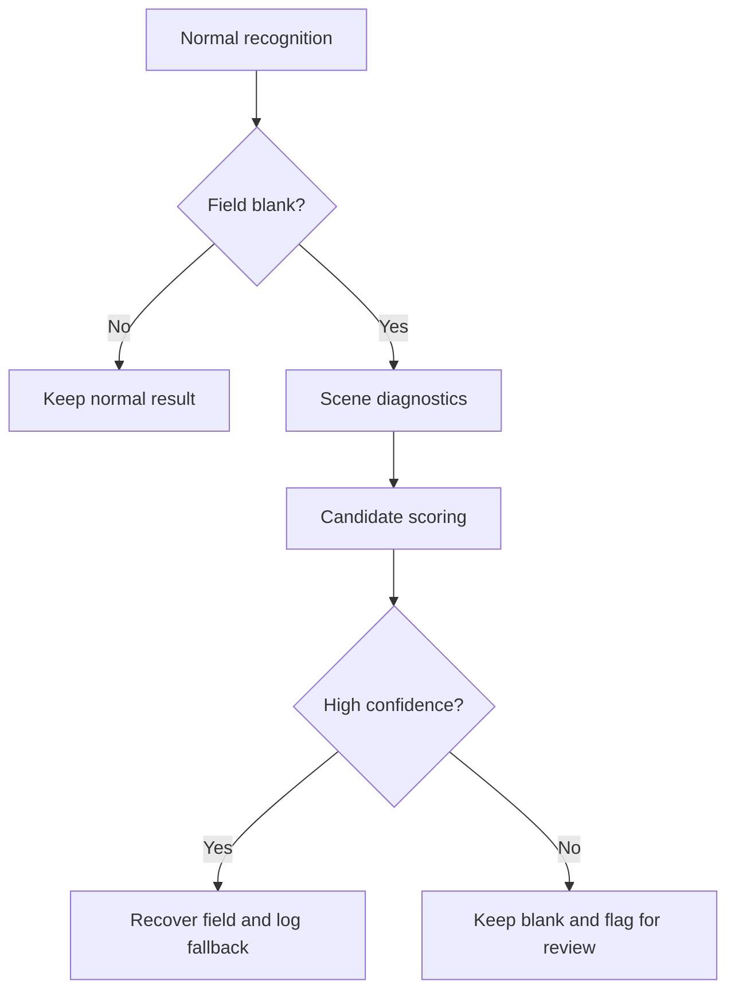

# Adaptive Weak-fill Recognition Design

## Purpose

This document describes the proposed design for improving weak-fill recognition without relying on scenario-specific manual parameter tuning. It is written before implementation so that later code changes can be validated against an explicit design and test plan.

The immediate trigger is the 10-sheet weak-fill batch recorded in `docs/weak-fill-10-test.md`, where the current conservative pipeline produced:

```text
rows 10
id_blank_cells 12
q_blank_cells 3
blank_cells 15
blank_rows 6
```

The normal-fill non-regression baseline is recorded in `docs/normal-fill-56-baseline.md`, where the current optimized pipeline produced:

```text
rows 56
id_blank_cells 0
q_blank_cells 0
blank_rows 0
```

## Design Principle

Do not lower the global threshold and do not replace the main recognition image with an enhanced image.

The main recognition path should remain the source of truth. Enhancement and adaptive scoring should run only as a fallback for fields that are blank after normal recognition.

This protects the normal-fill baseline from broad false positives while still giving weak-fill fields a controlled recovery path.

## Why Not Start With Manual Parameters

A parameter-only approach tends to encode one batch's lighting, scanner, paper, and fill strength into fixed constants. That creates risk when the next batch has a different failure mode.

Examples of risky parameter-first fixes:

- Lowering the global threshold to catch faint marks.
- Broadly lowering `min_gap` for all fields.
- Raising `max_mean` until weak identifiers pass.
- Applying full-image contrast enhancement before the normal recognition path.

These can make blank bubbles, printed borders, dirt, or scan noise look like valid marks.

Instead, thresholds should be secondary safety bounds. The primary logic should be relative to the current page and current field.

## Proposed Architecture

Use a three-layer adaptive fallback architecture.



## Layer 1: Scene Diagnostics

Before deciding how to recover a blank field, compute diagnostic statistics for the current page and current field.

### Page-level diagnostics

For all configured bubble ROIs on the page:

- `page_blank_baseline`: estimate from the lighter portion of all bubble means.
- `page_dark_distribution`: distribution of darker bubble means.
- `page_contrast`: difference between likely blank and likely marked groups.
- `blank_density_estimate`: how many bubbles appear close to blank.
- `weak_fill_likelihood`: whether marked candidates are consistently close to blank.
- `fallback_candidate_count`: number of fields that would become fallback candidates.

### Field-level diagnostics

For a single blank field:

- Candidate means for all options or digits.
- Local blank baseline from the lighter half of candidates.
- Difference between darkest and second-darkest candidate.
- Difference between darkest candidate and local blank baseline.
- Difference between darkest candidate and page blank baseline.
- Whether the field is single-choice, multi-select, or identifier.
- Whether the template marks it as `multiSelect`.

### Scene labels

The diagnostics may classify pages or fields into labels such as:

- `normal_contrast`
- `weak_fill_low_contrast`
- `overall_dark_scan`
- `overall_light_scan`
- `possible_alignment_issue`
- `too_many_blank_fields`
- `too_many_fallback_candidates`

These labels should guide scoring behavior, but should not directly force a result.

## Layer 2: Candidate Scoring

Instead of using fixed parameters as the main decision, compute a confidence score for each candidate.

### Common score components

For the darkest candidate in a blank field:

```text
local_delta = local_blank_baseline - darkest_mean
page_delta = page_blank_baseline - darkest_mean
candidate_gap = second_darkest_mean - darkest_mean
relative_rank = candidate position in current page distribution
```

A candidate is stronger when:

- It is clearly darker than local blank options.
- It is clearly darker than the second candidate.
- It is darker than page blank baseline by a meaningful margin.
- It fits the field structure, such as exactly one mark for a single-choice field.

### Single-choice scoring

Only applies when:

- Field type is `QTYPE_MCQ4`.
- The field is not marked `multiSelect`.
- Normal recognition found no candidate.

High confidence requires:

- One clearly darkest option.
- Strong local blank contrast.
- No evidence that multiple options are similarly dark.

The weak-fill 10-sheet test showed these blank answer candidates:

```text
001 q5 darkest=A mean=209.01 gap=25.64 delta_from_blank=45.99
008 q3 darkest=A mean=205.15 gap=10.61 delta_from_blank=39.23
009 q6 darkest=D mean=158.74 gap=49.36 delta_from_blank=75.93
```

These should be recoverable by relative local scoring without lowering the normal threshold.

### Identifier scoring

Only applies when:

- Field type is `QTYPE_INT`.
- Normal recognition found no digit for that identifier column.

Identifier recovery is higher risk than answer recovery because it changes student identity. It should require stricter audit and confidence checks.

High confidence should consider:

- One clearly darkest digit.
- Local blank contrast.
- Page-level weak-fill context.
- Whether several neighboring identifier digits are also blank or weak.
- Whether fallback count on the same page is unusually high.

The weak-fill 10-sheet test showed multiple identifier blanks with candidate gaps around 11 to 19 and local blank deltas around 14 to 23. This suggests a weak-fill identifier mode is needed, but it should be guarded by page/field diagnostics rather than a simple global parameter decrease.

### Multi-select scoring

Multi-select fields already have separate weak multi-mark and full-select fallback logic. The adaptive design should keep those paths separate because multi-select can legally have multiple marked options.

For multi-select:

- Do not reuse single-choice scoring.
- Continue using template-level `multiSelect=true`.
- Keep all-option `ABCD` support.
- Treat weak partial selections and weak full selections as separate cases.

## Layer 3: Conservative Decision

A fallback should be applied only when confidence is high. Otherwise the field should remain blank and be flagged for manual review.

Decision rules:

1. Never modify a non-blank normal recognition result in the first adaptive version.
2. Apply fallback only to blank fields.
3. Recover at most one candidate for single-choice and identifier fields.
4. Log every fallback with diagnostics.
5. Warn if fallback count per page exceeds a configurable review threshold.
6. Keep low-confidence candidates blank instead of guessing.

Example log format:

```text
Adaptive weak fallback: field 'q5' -> 'A' (scene=weak_fill_low_contrast, local_delta=45.99, gap=25.64, page_blank_baseline=..., confidence=high)
```

## Image Enhancement Strategy

Enhancement can be useful, but it should be a side channel rather than the main input.

Allowed enhancement usage:

- Only for blank fields.
- Only for scoring candidate ROIs.
- Only after normal recognition fails.
- Never replace the page image used by normal recognition.

Candidate techniques:

- CLAHE on a small local region.
- Local contrast stretch within the field ROI.
- Background subtraction using local blank candidates.
- High-DPI render for candidate scoring, then map back to existing template coordinates.

The first implementation should start with relative grayscale scoring before adding CLAHE, because the current weak-fill blank fields already show measurable local contrast in the existing PNG output.

## Proposed Initial Implementation

The first implementation should be minimal and low risk:

1. Add page and field diagnostic helpers.
2. Fix single-choice weak fallback so it works with the current template orientation.
3. Add local blank-baseline scoring to single-choice weak fallback.
4. Extend identifier fallback with adaptive weak-fill scoring based on page and local diagnostics.
5. Keep normal recognition unchanged.
6. Keep multi-select logic unchanged unless a weak-fill multi-select failure appears.

This implementation should avoid adding a user-facing `weak_fill_mode` switch at first. The system should infer weak-fill context from page and field diagnostics.

## Configuration Philosophy

Configuration should provide guardrails, not scene selection.

Acceptable configuration:

- Enable or disable fallback families.
- Define maximum fallback count before warning.
- Define conservative safety caps.
- Define logging/audit behavior.

Avoid configuration like:

```text
scene=weak_fill
min_gap=10
max_mean=212
```

Prefer adaptive behavior like:

```text
if page diagnostics indicate weak low-contrast fills and field candidate confidence is high, recover blank field
```

## Validation Plan

### Phase 1: Weak-fill 10-sheet improvement

Run:

```bash
python main.py -i inputs -o outputs_inputs_10_weak_fill_adaptive
```

Target:

```text
rows 10
q_blank_cells 0
id_blank_cells lower than 12, ideally 0
```

Every recovered field must have a log entry with candidate diagnostics.

### Phase 2: Normal-fill 56-sheet non-regression

Restore the normal-fill 56-sheet input set and run:

```bash
python main.py -i inputs -o outputs_inputs_56_adaptive_regression
```

Required:

```text
rows 56
id_blank_cells 0
q_blank_cells 0
blank_rows 0
```

Compare against `outputs_inputs_56_weak_identifier/Results/Results_03PM.csv` or the normal-fill baseline report:

- No unexpected answer differences.
- No broad increase in fallback count.
- Existing legal `ABCD` multi-select answers remain recognized.

### Phase 3: Documentation

For every test run, update or create a docs report with:

- Input set.
- Command.
- Output paths.
- CSV summary.
- Fallback trigger summary.
- Cell-level diff against the appropriate baseline.
- Manual review notes for any low-confidence or surprising recovery.

## Merge Criteria

The optimization branch can be merged back to `robyn-web-service` only when:

1. The weak-fill 10-sheet result improves materially.
2. The normal-fill 56-sheet baseline does not regress.
3. Every fallback is auditable.
4. The implementation does not replace the main recognition image.
5. The docs include both test results and known limitations.

## Open Questions

- Should identifier fallback have a stricter confidence threshold than answer fallback even in weak-fill pages?
- What per-page fallback count should trigger manual review?
- Should low-confidence candidates be exported to a separate review CSV?
- Would high-DPI side-channel scoring help if future weak-fill scans lose more detail during PNG conversion?
- How should the service API expose fallback audit details to Java callers?
