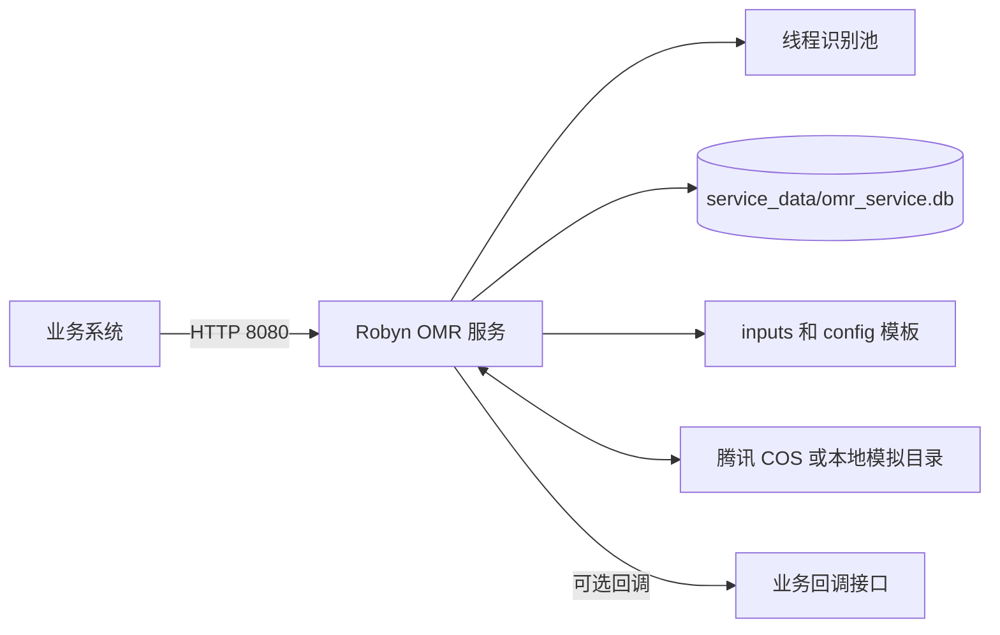

# OMRChecker Linux 部署指南

本文档面向当前分支的 Robyn Web 服务 `web/robyn_app.py`，覆盖 Docker Compose 和 Linux 原生部署。生产环境优先使用 Docker Compose，原生部署适合受限环境或问题排查。

## 文档导航

- [Docker Compose 部署](docker-compose.md)：推荐方案，包含 Docker 安装、配置、启动、升级、备份和反向代理。
- [Linux 原生部署](linux-native.md)：Python 虚拟环境、OpenCV 系统库和 systemd 服务配置。
- [运维与故障排查](operations.md)：健康检查、日志、权限、COS、SQLite 和性能问题。
- API 调用方式见 [Robyn Web Service API](../robyn-web-service.md)。

## 服务构成

当前服务包含两类接口：

1. `/api/omr/tasks`：上传单个文件。任务状态保存在进程内，服务重启后丢失。
2. `/api/omr/batches`：从 COS 或本地模拟对象存储批量识别。任务记录保存在 SQLite 中。

## 推荐生产基线

| 项目 | 建议 |
| --- | --- |
| Linux | Ubuntu 22.04/24.04、Debian 12 或兼容发行版 |
| 架构 | x86_64；ARM64 需先验证 Robyn、OpenCV 和 PyMuPDF wheel |
| 容器方案 | Docker Engine 24+，Docker Compose v2 |
| 原生方案 | CPython 3.11，使用独立虚拟环境 |
| CPU | 4 核起，识别为 CPU 密集型 |
| 内存 | 8 GiB 起；并发和 PDF 页数较大时按压测增加 |
| 磁盘 | 至少预留 20 GiB，并监控 `service_data` 增长 |

## 部署前必须准备

1. 可访问的服务端口，默认 TCP `8080`。公网环境建议仅暴露 Nginx 的 80/443。
2. 实际使用的 `inputs/` 模板文件，通常至少包含 `template.json`、`config.json` 和引用图片。
3. 可写的 `service_data/` 持久化目录。
4. 使用批量 COS 接口时准备 COS 地域、Bucket、SecretId、SecretKey。
5. 使用完成回调时，确保容器或主机能够访问回调 URL。

> 安全提示：不要把 `.env`、`config/robyn-service.json` 或 COS 密钥提交到 Git。优先为服务创建最小权限的 COS 子账号密钥，并定期轮换。

## 关键配置优先级

服务从项目根目录读取 `config/robyn-service.json`，并自动读取 `.env`。环境变量优先于 JSON 中对应配置。

| 环境变量 | 默认值 | 说明 |
| --- | --- | --- |
| `OMR_SERVICE_HOST` | `127.0.0.1` | 原生启动监听地址；Compose 固定为 `0.0.0.0` |
| `OMR_SERVICE_PORT` | `8080` | 服务端口；Compose 中 `.env` 值是宿主机端口 |
| `OMR_SERVICE_WORKERS` | `auto` | 识别线程数，可设正整数 |
| `OMR_SERVICE_DATA_DIR` | `service_data` | 工作目录和持久化数据目录 |
| `OMR_TEMPLATE_DIR` | `inputs` | 默认模板目录 |
| `OMR_CALLBACK_URL` | 空 | 批量任务默认回调地址 |
| `OMR_RECOGNITION_DEBUG_ARTIFACTS` | `false` | 是否保留调试中间文件 |
| `COS_SECRET_ID` | 空 | 腾讯 COS SecretId |
| `COS_SECRET_KEY` | 空 | 腾讯 COS SecretKey |

`server.workers` 或 `OMR_SERVICE_WORKERS` 为 `auto` 时，服务根据容器 CPU 配额和主机可用 CPU 计算并发数。生产环境建议先设为 `2` 或 `4` 压测，再逐步调高。
