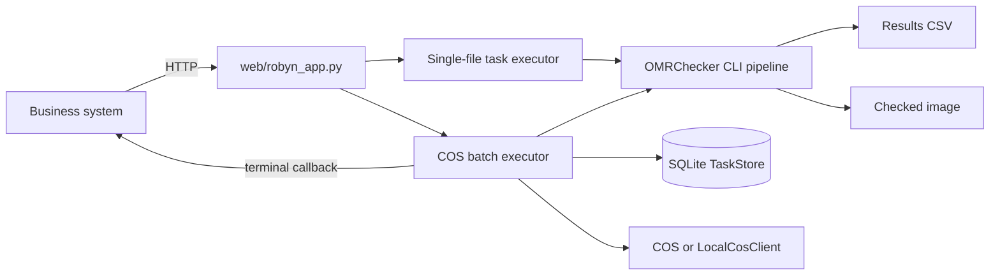
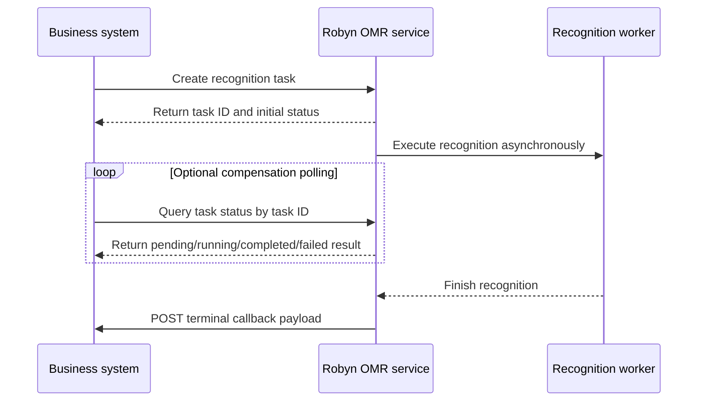

# Robyn Web Service API

This document is the maintained integration guide for the current `web/robyn_app.py` implementation. It describes the API as implemented in code, not a future design.

## Runtime architecture



There are two integration modes:

1. Single-file task API under `/api/omr/tasks`.
2. COS batch API under `/api/omr/batches`, with alias `/api/omr/batch-tasks`.

For business-system integration, prefer the COS batch API when source files already live in object storage.

## Recognition task lifecycle

Yes. The intended integration flow in the current implementation is:



Use the create-task response `task_id` or `taskId` as the only identifier for later status queries:

| Mode | Create recognition task | Query recognition task status | Completion callback |
| --- | --- | --- | --- |
| Single-file upload | `POST /api/omr/tasks` | `GET /api/omr/tasks/{task_id}` | Optional `callback_url` form field. |
| COS batch | `POST /api/omr/batches` or `POST /api/omr/batch-tasks` | `GET /api/omr/batches/{taskId}` | Callback target comes from `callback.url` config by default. Request `callbackUrl` can override it. |

Polling is a compensation mechanism. The business system should still support polling because callbacks can fail or arrive late. The terminal callback payload is the same shape as the corresponding task-status query payload at completion or failure.

## Configuration actually used by current code

### Single-file task API

The single-file API uses module-level environment variables read when `web/robyn_app.py` starts:

| Variable | Default | Meaning |
| --- | --- | --- |
| `OMR_SERVICE_PORT` | `8080` | Robyn HTTP port. |
| `OMR_SERVICE_WORKERS` | `1` | Worker count for both single and batch executors. |
| `OMR_SERVICE_DATA_DIR` | `service_data` | Single-task work/output directory root. |
| `OMR_TEMPLATE_DIR` | `inputs` | Template directory copied into uploaded single-task input folders. |

### COS batch API

The batch API uses `load_service_config()` and reads `config/robyn-service.json` if present. It also applies these environment overrides:

| Variable | Overrides |
| --- | --- |
| `OMR_SERVICE_PORT` | `server.port` for process startup. |
| `OMR_SERVICE_WORKERS` | `server.workers` in loaded config, and module executor size. |
| `OMR_SERVICE_DATA_DIR` | `storage.serviceDataDir`. |
| `OMR_TEMPLATE_DIR` | `storage.templateDir`. |
| `OMR_CALLBACK_URL` | `callback.url`, the default COS batch terminal callback endpoint. |
| `OMR_RECOGNITION_DEBUG_ARTIFACTS` | `recognition.debugArtifacts`. |

Use `config/robyn-service.example.json` as the starting point for `config/robyn-service.json`.

For Windows paths with Chinese characters, start with UTF-8 mode:

```cmd
python -X utf8 web\robyn_app.py
```
```cmd
python3 main.py
```
```cmd
 python3 main.py -i inputs -o outputs
```
## Docker Compose deployment on port 8088

Use this path for local or server deployment when you want the Robyn API to run in Docker with CPU-only PaddleOCR support. The compose service exposes the API on host port `8088` and keeps runtime data on the host.

### 1. Install server host dependencies

The Docker deployment automatically installs the Python application dependencies, PaddleOCR CPU runtime, and Linux image-processing libraries inside the container image when you run `docker compose up -d --build omr-api`.

The server host still needs Docker Engine, the Docker Compose plugin, Git, and network access to pull base images and Python packages.

#### Ubuntu or Debian server

Install Docker from the official Docker APT repository:

```bash
sudo apt-get update
sudo apt-get install -y ca-certificates curl gnupg git

sudo install -m 0755 -d /etc/apt/keyrings
curl -fsSL https://download.docker.com/linux/ubuntu/gpg \
  | sudo gpg --dearmor -o /etc/apt/keyrings/docker.gpg
sudo chmod a+r /etc/apt/keyrings/docker.gpg

echo \
  "deb [arch=$(dpkg --print-architecture) signed-by=/etc/apt/keyrings/docker.gpg] https://download.docker.com/linux/ubuntu \
  $(. /etc/os-release && echo "$VERSION_CODENAME") stable" \
  | sudo tee /etc/apt/sources.list.d/docker.list > /dev/null

sudo apt-get update
sudo apt-get install -y docker-ce docker-ce-cli containerd.io docker-buildx-plugin docker-compose-plugin
```

For Debian, use the Debian Docker repository URL instead:

```bash
curl -fsSL https://download.docker.com/linux/debian/gpg \
  | sudo gpg --dearmor -o /etc/apt/keyrings/docker.gpg

echo \
  "deb [arch=$(dpkg --print-architecture) signed-by=/etc/apt/keyrings/docker.gpg] https://download.docker.com/linux/debian \
  $(. /etc/os-release && echo "$VERSION_CODENAME") stable" \
  | sudo tee /etc/apt/sources.list.d/docker.list > /dev/null
```

Then run the same `sudo apt-get update` and `sudo apt-get install ...` commands above.

Verify Docker and Compose:

```bash
sudo docker version
sudo docker compose version
```

Optional: allow the current user to run Docker without `sudo`. Log out and back in after this command:

```bash
sudo usermod -aG docker "$USER"
```

If the server firewall is enabled, open the API port:

```bash
sudo ufw allow 8088/tcp
```

For cloud servers, also allow inbound TCP `8088` in the provider security group or firewall.

#### CentOS, RHEL, Rocky Linux, or AlmaLinux server

Install Docker and the Compose plugin:

```bash
sudo dnf install -y yum-utils git
sudo yum-config-manager --add-repo https://download.docker.com/linux/centos/docker-ce.repo
sudo dnf install -y docker-ce docker-ce-cli containerd.io docker-buildx-plugin docker-compose-plugin
sudo systemctl enable --now docker
```

Verify Docker and Compose:

```bash
sudo docker version
sudo docker compose version
```

Optional: allow the current user to run Docker without `sudo`. Log out and back in after this command:

```bash
sudo usermod -aG docker "$USER"
```

If production COS batch recognition is enabled, the Python dependency set must include Tencent COS SDK `cos-python-sdk-v5`, which provides the `qcloud_cos` import used by the service.

If `firewalld` is enabled, open the API port:

```bash
sudo firewall-cmd --add-port=8088/tcp --permanent
sudo firewall-cmd --reload
```

#### Offline or restricted-network servers

The first image build needs access to:

- Docker Hub, for `python:3.12-slim`.
- Debian package mirrors, for `apt-get install` inside the image.
- PyPI, for `requirements.txt`, `paddlepaddle==3.2.0`, and `paddleocr==3.7.0`.

If the server cannot access these networks, build the image on a networked machine and transfer it:

```bash
docker compose build omr-api
docker save omrchecker-paddleocr:local | gzip > omrchecker-paddleocr-local.tar.gz
scp omrchecker-paddleocr-local.tar.gz user@server:/path/to/deploy/
```

On the server:

```bash
gunzip -c omrchecker-paddleocr-local.tar.gz | sudo docker load
sudo docker compose up -d omr-api
```

### 2. Prepare runtime files and directories

From the repository root:

```bash
cp .env.docker.example .env.docker
mkdir -p service_data outputs inputs config
```

If you need production COS batch recognition, create `config/robyn-service.json` from `config/robyn-service.example.json` and fill in the real COS bucket, region, callback URL, and credentials. The compose file mounts `./config` read-only into the container.

For local mock-COS mode, keep COS disabled in `config/robyn-service.json` or omit the file and use the service defaults.

### 3. Review Docker environment

The deployment defaults are defined in `.env.docker.example` and `docker-compose.yml`:

```dotenv
OMR_SERVICE_PORT=8088
OMR_SERVICE_HOST=0.0.0.0
OMR_SERVICE_WORKERS=1
OMR_SERVICE_DATA_DIR=/app/service_data
OMR_TEMPLATE_DIR=/app/inputs
OMR_RECOGNITION_DEBUG_ARTIFACTS=false
```

`OMR_SERVICE_HOST=0.0.0.0` is required inside Docker so host port forwarding can reach Robyn. The compose file maps `8088:8088`.

### 4. Build and start the service

Start or redeploy the API and leave it running for manual interface testing:

```bash
docker compose up -d --build omr-api
```

If your deployment user is not in the `docker` group, use:

```bash
sudo docker compose up -d --build omr-api
```

For a faster restart when the image is already built:

```bash
docker compose up -d omr-api
```

Do not run `docker compose down` if you want to keep the API available for manual testing.

### 5. Verify the deployment

Check service state:

```bash
docker compose ps
```

If you used `sudo` to start the service, also use `sudo docker compose ps`.

Expected port mapping includes:

```text
0.0.0.0:8088->8088/tcp
```

Check health from the host:

```bash
curl http://127.0.0.1:8088/health
```

Expected response shape:

```json
{
  "status": "ok",
  "service": "omrchecker-robyn",
  "workers": 1,
  "template_dir": "/app/inputs"
}
```

Useful troubleshooting commands:

```bash
docker compose logs -f omr-api
docker compose config
```

### 6. Stop only when validation is finished

When you no longer need the service running:

```bash
docker compose down
```

### Non-Docker direct-run dependency note

If you do not use Docker and run `python web/robyn_app.py` directly on the server, dependencies are not installed automatically. You must install system packages and Python packages on the host manually. Docker deployment is recommended because it keeps these dependencies isolated.

Ubuntu/Debian direct-run example:

```bash
sudo apt-get update
sudo apt-get install -y python3.12 python3.12-venv python3-pip git \
  curl fonts-noto-cjk libglib2.0-0 libgl1 libgomp1 libsm6 libxext6 libxrender1 poppler-utils

python3.12 -m venv .venv-ocr-prod
. .venv-ocr-prod/bin/activate
python -m pip install --upgrade pip
python -m pip install -r requirements.txt
python -m pip install paddlepaddle==3.2.0 paddleocr==3.7.0

OMR_SERVICE_HOST=0.0.0.0 \
OMR_SERVICE_PORT=8088 \
OMR_SERVICE_DATA_DIR=service_data \
OMR_TEMPLATE_DIR=inputs \
python web/robyn_app.py
```

Windows direct-run example from the repository root:

```powershell
winget install --id Python.Python.3.12 --source winget
py -3.12 -m venv .venv-ocr-prod
.\.venv-ocr-prod\Scripts\python.exe -m pip install --upgrade pip
.\.venv-ocr-prod\Scripts\python.exe -m pip install -r requirements.txt paddlepaddle==3.2.0 paddleocr==3.7.0

$env:OMR_SERVICE_HOST = "0.0.0.0"
$env:OMR_SERVICE_PORT = "8088"
$env:OMR_SERVICE_DATA_DIR = "service_data"
$env:OMR_TEMPLATE_DIR = "inputs"
.\.venv-ocr-prod\Scripts\python.exe web\robyn_app.py
```

For `cmd.exe`, use `set OMR_SERVICE_PORT=8088` style environment assignments before the final Python command. Verify the OCR runtime before starting the service:

```powershell
.\.venv-ocr-prod\Scripts\python.exe -c "import paddle, paddleocr; print(paddle.__version__); print(getattr(paddleocr, '__version__', 'unknown'))"
```

## Health check

### `GET /health`

Returns the process-level service status.

```bash
curl http://localhost:8080/health
```

Response shape:

```json
{
  "status": "ok",
  "service": "omrchecker-robyn",
  "workers": 1,
  "template_dir": "inputs"
}
```

`template_dir` is the module-level `_TEMPLATE_DIR`, so it reflects `OMR_TEMPLATE_DIR`, not necessarily the full batch `config/robyn-service.json` object.

## Single-file task flow

This flow stores tasks only in process memory. It is useful for direct uploads and simple integration, but task records are lost when the service restarts.

### 1. Create a single-file recognition task

`POST /api/omr/tasks`

Supported input is `multipart/form-data` with at least one file field. The current implementation uses the multipart field name as the saved file name.

Optional form fields:

| Field | Meaning |
| --- | --- |
| `callback_url` | Optional terminal callback URL. Must start with `http://` or `https://`. |
| `external_task_id` | Caller task ID echoed in task records and callbacks. |
| `batch_id` | Caller batch/group ID used by list filtering. |

Example:

```bash
curl -X POST http://localhost:8080/api/omr/tasks \
  -F "sheet.pdf=@/absolute/path/to/sheet.pdf" \
  -F "external_task_id=java-task-001" \
  -F "batch_id=batch-001" \
  -F "callback_url=https://java.example.com/omr/task-callback"
```

Queued response:

```json
{
  "task_id": "a1b2c3...",
  "status": "queued",
  "external_task_id": "java-task-001",
  "batch_id": "batch-001",
  "links": {
    "self": "/api/omr/tasks/a1b2c3..."
  }
}
```

If parsing or preparation fails, the implementation returns a JSON body like:

```json
{"status": "failed", "error": "..."}
```

### 2. Trusted JSON single-task mode

`POST /api/omr/tasks` also accepts JSON with `input_dir`. This does not copy uploaded files. It runs recognition directly against the supplied directory and writes output under `service_data/tasks/<task_id>/output`.

```json
{
  "input_dir": "inputs",
  "task_id": "optional-caller-safe-id"
}
```

This mode is intended for internal smoke tests or trusted servers only.

### 3. Query single-file recognition task status

`GET /api/omr/tasks/{task_id}`

```bash
curl http://localhost:8080/api/omr/tasks/a1b2c3...
```

While the background future is still running, a queued task is presented as `running`.

Completed response shape:

```json
{
  "task_id": "a1b2c3...",
  "status": "completed",
  "created_at": "2026-08-04T10:00:00+00:00",
  "updated_at": "2026-08-04T10:00:03+00:00",
  "started_at": null,
  "completed_at": "2026-08-04T10:00:03+00:00",
  "external_task_id": "java-task-001",
  "batch_id": "batch-001",
  "callback": {
    "url": "https://java.example.com/omr/task-callback",
    "status": "delivered",
    "attempts": 1,
    "last_error": null,
    "last_attempt_at": "2026-08-04T10:00:03+00:00"
  },
  "input_dir": "service_data/tasks/a1b2c3.../input",
  "output_dir": "service_data/tasks/a1b2c3.../output",
  "upload_name": "sheet.pdf",
  "result": {
    "input_dir": "service_data/tasks/a1b2c3.../input",
    "output_dir": "service_data/tasks/a1b2c3.../output",
    "results_csv": "service_data/tasks/a1b2c3.../output/Results/Results_10AM.csv",
    "count": 1,
    "results": [
      {
        "file_id": "sheet.png",
        "input_path": "service_data/tasks/a1b2c3.../input/sheet.pdf",
        "output_path": "service_data/tasks/a1b2c3.../output/CheckedOMRs/sheet.png",
        "score": "0",
        "exam_id": "",
        "answers": [
          {
            "regionCode": "candidateNumber",
            "regionName": "准考证号区域",
            "type": "DIGIT",
            "items": [
              {"field": "id1", "value": "3", "confidence": 1.0},
              {"field": "id2", "value": "5", "confidence": 1.0}
            ]
          },
          {
            "regionCode": "singleChoice",
            "regionName": "单选题区域",
            "type": "SINGLE_CHOICE",
            "items": [
              {"field": "q1", "value": "A", "confidence": 1.0}
            ]
          }
        ],
        "answers_flat": {"q1": "A"},
        "weak_marks": [],
        "review_required": false,
        "checked_image_url": "/api/omr/tasks/a1b2c3.../checked-image/sheet.png"
      }
    ]
  },
  "error": null
}
```

Not found response:

```json
{"status": "not_found", "task_id": "a1b2c3..."}
```

### 4. List single-file tasks

`GET /api/omr/tasks`

Supported filters:

| Query parameter | Meaning |
| --- | --- |
| `status` | Exact match, for example `queued`, `running`, `completed`, `failed`. |
| `batch_id` | Exact caller batch ID. |
| `external_task_id` | Exact caller task ID. |
| `limit` | Positive page size, default `50`. |
| `offset` | Non-negative offset, default `0`. |

Example:

```bash
curl "http://localhost:8080/api/omr/tasks?status=completed&batch_id=batch-001&limit=50&offset=0"
```

Response shape:

```json
{
  "total": 1,
  "limit": 50,
  "offset": 0,
  "tasks": [
    {
      "task_id": "a1b2c3...",
      "external_task_id": "java-task-001",
      "batch_id": "batch-001",
      "status": "completed",
      "created_at": "2026-08-04T10:00:00+00:00",
      "updated_at": "2026-08-04T10:00:03+00:00",
      "completed_at": "2026-08-04T10:00:03+00:00",
      "result_count": 1,
      "callback_status": "delivered",
      "links": {"self": "/api/omr/tasks/a1b2c3..."}
    }
  ]
}
```

### 5. Download single-file task artifacts

CSV:

```bash
curl -OJ http://localhost:8080/api/omr/tasks/a1b2c3.../results-csv
```

Checked image:

```bash
curl -OJ http://localhost:8080/api/omr/tasks/a1b2c3.../checked-image/sheet.png
```

If a file does not exist, the implementation returns a JSON `not_found` body.

### 6. Single-file callback behavior

If `callback_url` was provided, the service posts the terminal `GET /api/omr/tasks/{task_id}` payload after completion or failure. It tries up to three times in the background completion callback.

## COS batch flow

The batch flow is persisted in SQLite through `TaskStore`. It is better suited for business-system integration and callback compensation.

### 1. Prepare runtime config

Create `config/robyn-service.json`.

For local fake COS:

```json
{
  "server": {"port": 8080, "workers": 1},
  "storage": {
    "serviceDataDir": "service_data",
    "templateDir": "docs/assets/A3风格模板/template",
    "archivePrefix": "omr-archive"
  },
  "database": {"url": "sqlite:///service_data/omr_service.db"},
  "cos": {"enabled": false, "localRoot": "service_data/cos_mock"},
  "callback": {"maxAttempts": 3, "timeoutSeconds": 10},
  "recognition": {"debugArtifacts": false},
  "archiveRegions": []
}
```

For real COS, set `cos.enabled=true` and fill `region`, `bucket`, `secretId`, and `secretKey`. `${ENV_NAME}` placeholders are resolved from environment variables.

Important implementation detail: batch recognition copies top-level files from `storage.templateDir` into each sheet workdir. Keep `config.json`, `template.json`, and `reference.png` directly in that directory.

### 2. Place source sheets in COS or fake COS

For fake COS, an `osskey` maps to a file below `cos.localRoot`.

Example:

```text
service_data/cos_mock/incoming/exam-001/sheet-001.pdf
```

Use `osskey`:

```text
incoming/exam-001/sheet-001.pdf
```

### 3. Create a COS batch recognition task

`POST /api/omr/batches`

Alias also implemented:

`POST /api/omr/batch-tasks`

Request body fields:

| Field | Required | Meaning |
| --- | --- | --- |
| `examId` | yes | Business exam ID. Must be a non-empty string. |
| `callbackUrl` | no | Terminal callback URL. If omitted, Robyn uses `callback.url` from `config/robyn-service.json` or `OMR_CALLBACK_URL`. Must be a non-empty string when supplied. |
| `externalBatchId` | no | Caller batch ID. Must be non-empty if supplied. |
| `templateCode` | no | Template code such as `ASTS-HTTP-001`. When supplied, Robyn copies top-level files from project `config/<templateCode>/<schemaVersion>/` into each sheet workdir before writing request `template.json` and `config.json`. Use this for binary/template dependency files such as `reference.png`. |
| `schemaVersion` | no | Template schema/version such as `v1` or `v2`. Required when `templateCode` is used to select a non-default schema. If omitted with `templateCode`, Robyn defaults to `v1`. |
| `recognitionConfig` | no | Object. `debugArtifacts` controls debug workdirs. `template` or `templateConfig`, when supplied as objects, are written as runtime `template.json`. `config`, when supplied as an object, is normalized from Java-friendly camelCase section/key names to OMRChecker runtime `config.json` keys. Other keys are persisted but not interpreted. |
| `recognitionConfig.debugArtifacts` | no | Boolean. Overrides config default for preserving sheet workdirs. |
| `sheets` | yes | Non-empty list of sheet objects. |
| `sheets[].sheetId` | yes | Business sheet ID. |
| `sheets[].osskey` | yes | Source object key to download from COS or fake COS. |
| `sheets[].metadata` | no | Object persisted in request JSON. Current callback response does not echo it as a top-level field. |

Example:

```bash
curl -X POST http://localhost:8080/api/omr/batches \
  -H "Content-Type: application/json" \
  -d '{
      "examId": 17,
      "templateSpecId": 1,
      "templateCode": "ASTS-HTTP-001",
      "schemaVersion": "v1",
      "externalBatchId": "scan_batch_file:1785991732373",
      "attemptNo": 1785991732373,
      "batchId": 1,
      "recognitionConfig": {
          "debugArtifacts": false,
          "config": {
              "dimensions": {
                  "displayHeight": 1682,
                  "displayWidth": 1190,
                  "processingHeight": 1682,
                  "processingWidth": 1190
              },
              "outputs": {
                  "showImageLevel": 0,
                  "saveImageLevel": 0,
                  "saveDetections": true
              },
              "thresholdParams": {
                  "gammaLow": 0.7,
                  "minGap": 30,
                  "minJump": 25,
                  "confidentSurplus": 5,
                  "jumpDelta": 30,
                  "pageTypeForThreshold": "white"
              },
              "alignmentParams": {
                  "autoAlign": false
              },
              "pdfParams": {
                  "pdfDpi": 144,
                  "pdfPage": 1
              },
              "weakMarkParams": {
                  "enabled": true,
                  "minGap": 10,
                  "maxMean": 215,
                  "supportedFieldTypes": [
                      "QTYPE_MCQ4"
                  ],
                  "excludeLabels": [

                  ]
              },
              "weakIdentifierParams": {
                  "enabled": true,
                  "labels": [

                  ],
                  "excludeLabels": [

                  ],
                  "minGap": 20,
                  "minDeltaFromBlank": 25,
                  "maxMean": 205,
                  "supportedFieldTypes": [
                      "QTYPE_INT"
                  ]
              },
              "weakMultiMarkParams": {
                  "enabled": true,
                  "labels": [

                  ],
                  "onlyWhenBlank": true,
                  "minDeltaFromBlank": 10,
                  "maxMean": 218,
                  "maxMarks": 4,
                  "fullSelectFallbackEnabled": true,
                  "fullSelectMaxMean": 170,
                  "fullSelectMinDeltaFromBlank": 35,
                  "fullSelectMaxSpread": 25
              }
          },
          "templateConfig": {

          }
      },
      "sheets": [
          {
              "sheetId": 1,
              "osskey": "private/exam/exam_scan/exam-http-invalid/raw/2026/08/05/f_5179f1de8a1348b784f5b73c48ffdb7d.pdf"
          },
          {
              "sheetId": 2,
              "osskey": "private/exam/exam_scan/exam-http-invalid/raw/2026/08/05/f_2612d885d2f54d1591258abfcfa22ba4.pdf"
          },
          {
              "sheetId": 3,
              "osskey": "private/exam/exam_scan/exam-http-invalid/raw/2026/08/05/f_5a9b0d186bf04a5382298ebd2315552d.pdf"
          },
          {
              "sheetId": 4,
              "osskey": "private/exam/exam_scan/exam-http-invalid/raw/2026/08/05/f_ebf6bf8281f04bf0865b0de3ce0709c7.pdf"
          },
          {
              "sheetId": 5,
              "osskey": "private/exam/exam_scan/exam-http-invalid/raw/2026/08/05/f_fa0b028c1f5e4e88afce4bee73312a56.pdf"
          },
          {
              "sheetId": 6,
              "osskey": "private/exam/exam_scan/exam-http-invalid/raw/2026/08/05/f_391771b4930b4028bd5c8a3bbf42c77f.pdf"
          },
          {
              "sheetId": 7,
              "osskey": "private/exam/exam_scan/exam-http-invalid/raw/2026/08/05/f_871204c1959d4337b7ee38242c08196e.pdf"
          },
          {
              "sheetId": 8,
              "osskey": "private/exam/exam_scan/exam-http-invalid/raw/2026/08/05/f_9890b12c0c6146149dc79cde9ede6b0d.pdf"
          },
          {
              "sheetId": 9,
              "osskey": "private/exam/exam_scan/exam-http-invalid/raw/2026/08/05/f_8423c661abf74de99ad6b7b218c0c7f4.pdf"
          },
          {
              "sheetId": 10,
              "osskey": "private/exam/exam_scan/exam-http-invalid/raw/2026/08/05/f_d35b58a07c8145bfb6af294ab066e62a.pdf"
          },
          {
              "sheetId": 11,
              "osskey": "private/exam/exam_scan/exam-http-invalid/raw/2026/08/05/f_8daa4987485041ac974ac3887254d221.pdf"
          },
          {
              "sheetId": 12,
              "osskey": "private/exam/exam_scan/exam-http-invalid/raw/2026/08/05/f_8e2887f7ac9a4e7baed9656c336d4a19.pdf"
          },
          {
              "sheetId": 13,
              "osskey": "private/exam/exam_scan/exam-http-invalid/raw/2026/08/05/f_38df99b73ab147ce88afc6905e6b38ba.pdf"
          },
          {
              "sheetId": 14,
              "osskey": "private/exam/exam_scan/exam-http-invalid/raw/2026/08/05/f_e6f19db47b02408eb56bf376a4f33197.pdf"
          },
          {
              "sheetId": 15,
              "osskey": "private/exam/exam_scan/exam-http-invalid/raw/2026/08/05/f_2501e0a8ff314c6e9b85de3f8f68e641.pdf"
          },
          {
              "sheetId": 16,
              "osskey": "private/exam/exam_scan/exam-http-invalid/raw/2026/08/05/f_25ef50dd558744028ba1bd63b7cd7ed4.pdf"
          },
          {
              "sheetId": 17,
              "osskey": "private/exam/exam_scan/exam-http-invalid/raw/2026/08/05/f_6c558cf9fb9c441b85cb3465bb61dfcd.pdf"
          },
          {
              "sheetId": 18,
              "osskey": "private/exam/exam_scan/exam-http-invalid/raw/2026/08/05/f_06321b8b9a9f46a3ad2c38d3e2554c18.pdf"
          },
          {
              "sheetId": 19,
              "osskey": "private/exam/exam_scan/exam-http-invalid/raw/2026/08/05/f_4515bcc92e3744578b65a3fc1ad60a6d.pdf"
          },
          {
              "sheetId": 20,
              "osskey": "private/exam/exam_scan/exam-http-invalid/raw/2026/08/05/f_3d5a1b2918794b38931785e8f288a33c.pdf"
          },
          {
              "sheetId": 21,
              "osskey": "private/exam/exam_scan/exam-http-invalid/raw/2026/08/05/f_baa5215adb194fc3a42477f6421bc7ce.pdf"
          },
          {
              "sheetId": 22,
              "osskey": "private/exam/exam_scan/exam-http-invalid/raw/2026/08/05/f_64b7740267b944bc82a218b1246224b5.pdf"
          },
          {
              "sheetId": 23,
              "osskey": "private/exam/exam_scan/exam-http-invalid/raw/2026/08/05/f_66d568d9ac474df09542d3b6edd5a99c.pdf"
          },
          {
              "sheetId": 24,
              "osskey": "private/exam/exam_scan/exam-http-invalid/raw/2026/08/05/f_54fab7cbf758454dae794f5efc31c758.pdf"
          },
          {
              "sheetId": 25,
              "osskey": "private/exam/exam_scan/exam-http-invalid/raw/2026/08/05/f_51b0d042862e42319176b93e788d6cc3.pdf"
          },
          {
              "sheetId": 26,
              "osskey": "private/exam/exam_scan/exam-http-invalid/raw/2026/08/05/f_d65d28bde1cb4d50ab4d5f2cb5c9924f.pdf"
          },
          {
              "sheetId": 27,
              "osskey": "private/exam/exam_scan/exam-http-invalid/raw/2026/08/05/f_055dc7decce8442c8e93d957086d8c51.pdf"
          },
          {
              "sheetId": 28,
              "osskey": "private/exam/exam_scan/exam-http-invalid/raw/2026/08/05/f_a6f9c3d5b7264e39962617c36207d050.pdf"
          },
          {
              "sheetId": 29,
              "osskey": "private/exam/exam_scan/exam-http-invalid/raw/2026/08/05/f_2c960e907829482fbb3eb466c50edced.pdf"
          },
          {
              "sheetId": 30,
              "osskey": "private/exam/exam_scan/exam-http-invalid/raw/2026/08/05/f_e85fb6d678f64d3ebf80408f106c34c2.pdf"
          },
          {
              "sheetId": 31,
              "osskey": "private/exam/exam_scan/exam-http-invalid/raw/2026/08/05/f_1052fb3a16804c12bbcb129c25039bb1.pdf"
          },
          {
              "sheetId": 32,
              "osskey": "private/exam/exam_scan/exam-http-invalid/raw/2026/08/05/f_24a2f15e48fa4cb99a871b97b148deb3.pdf"
          },
          {
              "sheetId": 33,
              "osskey": "private/exam/exam_scan/exam-http-invalid/raw/2026/08/05/f_cf4597046de640d9936d9bc1b8ebe07b.pdf"
          },
          {
              "sheetId": 34,
              "osskey": "private/exam/exam_scan/exam-http-invalid/raw/2026/08/05/f_bd59c74dfb4442ffb5818d786a7d0f81.pdf"
          },
          {
              "sheetId": 35,
              "osskey": "private/exam/exam_scan/exam-http-invalid/raw/2026/08/05/f_19f0efc0db7f462699f70f31b124d88b.pdf"
          },
          {
              "sheetId": 36,
              "osskey": "private/exam/exam_scan/exam-http-invalid/raw/2026/08/05/f_e886b99489d8495cb3d32b534134ad22.pdf"
          },
          {
              "sheetId": 37,
              "osskey": "private/exam/exam_scan/exam-http-invalid/raw/2026/08/05/f_96bc866fc2754a7ab24d6bc9c949fdb4.pdf"
          },
          {
              "sheetId": 38,
              "osskey": "private/exam/exam_scan/exam-http-invalid/raw/2026/08/05/f_d3412ee93fc54f4f969f56c7313d961a.pdf"
          },
          {
              "sheetId": 39,
              "osskey": "private/exam/exam_scan/exam-http-invalid/raw/2026/08/05/f_4fc603ce5e1741339728df4bbc15456f.pdf"
          },
          {
              "sheetId": 40,
              "osskey": "private/exam/exam_scan/exam-http-invalid/raw/2026/08/05/f_3404f13cb08d45d6812d9c6c2d422002.pdf"
          },
          {
              "sheetId": 41,
              "osskey": "private/exam/exam_scan/exam-http-invalid/raw/2026/08/05/f_b61b0b6acb9d452e8498bebb8a45e574.pdf"
          },
          {
              "sheetId": 42,
              "osskey": "private/exam/exam_scan/exam-http-invalid/raw/2026/08/05/f_6df86763e69342b3ad4b18ba790790ea.pdf"
          },
          {
              "sheetId": 43,
              "osskey": "private/exam/exam_scan/exam-http-invalid/raw/2026/08/05/f_e70485aeffae4d8ba43fd52b78aac8e1.pdf"
          },
          {
              "sheetId": 44,
              "osskey": "private/exam/exam_scan/exam-http-invalid/raw/2026/08/05/f_cd020262fdc04505811fbdeaa7fbe1d2.pdf"
          },
          {
              "sheetId": 45,
              "osskey": "private/exam/exam_scan/exam-http-invalid/raw/2026/08/05/f_ab7b9877d0424ea88c617a18c4bbd252.pdf"
          },
          {
              "sheetId": 46,
              "osskey": "private/exam/exam_scan/exam-http-invalid/raw/2026/08/05/f_44c8d142ffe9475bb6dced8ee2a86508.pdf"
          },
          {
              "sheetId": 47,
              "osskey": "private/exam/exam_scan/exam-http-invalid/raw/2026/08/05/f_a3fe3d48278f475ea033aaea27f68495.pdf"
          },
          {
              "sheetId": 48,
              "osskey": "private/exam/exam_scan/exam-http-invalid/raw/2026/08/05/f_2c7209ec3ed64bfa845ded5b5bc4fd29.pdf"
          },
          {
              "sheetId": 49,
              "osskey": "private/exam/exam_scan/exam-http-invalid/raw/2026/08/05/f_cd72a202b05d4076ae9084cf369c439d.pdf"
          },
          {
              "sheetId": 50,
              "osskey": "private/exam/exam_scan/exam-http-invalid/raw/2026/08/05/f_ade404bfd31548229a3237aec4f59aa9.pdf"
          },
          {
              "sheetId": 51,
              "osskey": "private/exam/exam_scan/exam-http-invalid/raw/2026/08/05/f_8daf6a0b369648c8912821fc4c57459d.pdf"
          },
          {
              "sheetId": 52,
              "osskey": "private/exam/exam_scan/exam-http-invalid/raw/2026/08/05/f_282d7e46ff6e4c0abdd16471d3c87442.pdf"
          },
          {
              "sheetId": 53,
              "osskey": "private/exam/exam_scan/exam-http-invalid/raw/2026/08/05/f_6358288557fd4e6798f4b20d5bfaaef3.pdf"
          },
          {
              "sheetId": 54,
              "osskey": "private/exam/exam_scan/exam-http-invalid/raw/2026/08/05/f_854e9858d59f4439951255d3ea31d86a.pdf"
          },
          {
              "sheetId": 55,
              "osskey": "private/exam/exam_scan/exam-http-invalid/raw/2026/08/05/f_b643130c1a874286bb12fcabe0201d31.pdf"
          },
          {
              "sheetId": 56,
              "osskey": "private/exam/exam_scan/exam-http-invalid/raw/2026/08/05/f_42a14e65da974a268dbe705575424a37.pdf"
          },
          {
              "sheetId": 57,
              "osskey": "private/exam/exam_scan/exam-http-invalid/raw/2026/08/05/f_c9dbcc542f2e4293bab62f2f89b33d8b.pdf"
          },
          {
              "sheetId": 58,
              "osskey": "private/exam/exam_scan/exam-http-invalid/raw/2026/08/05/f_8af239a6353c41069fc53c508bdd202e.pdf"
          },
          {
              "sheetId": 59,
              "osskey": "private/exam/exam_scan/exam-http-invalid/raw/2026/08/05/f_8917df7e89e14fc4a6e183c645d61728.pdf"
          },
          {
              "sheetId": 60,
              "osskey": "private/exam/exam_scan/exam-http-invalid/raw/2026/08/05/f_bac60eca408643c1bac72e313dae3726.pdf"
          },
          {
              "sheetId": 61,
              "osskey": "private/exam/exam_scan/exam-http-invalid/raw/2026/08/05/f_973170a92c1c49be9605c6d8f3f7483a.pdf"
          },
          {
              "sheetId": 62,
              "osskey": "private/exam/exam_scan/exam-http-invalid/raw/2026/08/05/f_249d35ef100c410a8191eae51b101090.pdf"
          },
          {
              "sheetId": 63,
              "osskey": "private/exam/exam_scan/exam-http-invalid/raw/2026/08/05/f_068954d0ebb94c7683798ce56d863e07.pdf"
          },
          {
              "sheetId": 64,
              "osskey": "private/exam/exam_scan/exam-http-invalid/raw/2026/08/05/f_37027e406a4b4d2ca1b30e82c69fc20a.pdf"
          },
          {
              "sheetId": 65,
              "osskey": "private/exam/exam_scan/exam-http-invalid/raw/2026/08/05/f_5db64cdb847a445987dfcb79f3d9694c.pdf"
          },
          {
              "sheetId": 66,
              "osskey": "private/exam/exam_scan/exam-http-invalid/raw/2026/08/05/f_885ba914af8943dba7c1bbbed7062d56.pdf"
          }
      ]
  }'
```

Template-parameter request example based on `docs/assets/自制模板1/template`:

```json
{
  "examId": "exam-001",
  "externalBatchId": "biz-batch-001",
  "callbackUrl": "https://java.example.com/omr/batch-callback",
  "recognitionConfig": {
    "debugArtifacts": false,
    "template": {
      "pageDimensions": [1190, 1682],
      "bubbleDimensions": [29, 18],
      "outputColumns": [
        "id1", "id2", "id3", "id4", "id5", "id6", "id7", "id8",
        "q1", "q2", "q3", "q4", "q5", "q6", "q7", "q8", "q9", "q10", "q11"
      ],
      "preProcessors": [
        {
          "name": "FeatureBasedAlignment",
          "options": {
            "reference": "reference.png",
            "maxFeatures": 2000,
            "goodMatchPercent": 0.25,
            "2d": true
          }
        }
      ],
      "fieldBlocks": {
        "ExamId": {
          "fieldType": "QTYPE_INT",
          "fieldLabels": ["id1..8"],
          "bubbleDimensions": [30, 17],
          "bubblesGap": 27,
          "labelsGap": 44,
          "origin": [777, 396]
        },
        "Q1": {"fieldType": "QTYPE_MCQ4", "fieldLabels": ["q1"], "bubbleDimensions": [29, 18], "bubblesGap": 39, "labelsGap": 0, "origin": [134, 757]},
        "Q2": {"fieldType": "QTYPE_MCQ4", "fieldLabels": ["q2"], "bubbleDimensions": [29, 18], "bubblesGap": 39, "labelsGap": 0, "origin": [337, 757]},
        "Q3": {"fieldType": "QTYPE_MCQ4", "fieldLabels": ["q3"], "bubbleDimensions": [29, 18], "bubblesGap": 39, "labelsGap": 0, "origin": [540, 757]},
        "Q4": {"fieldType": "QTYPE_MCQ4", "fieldLabels": ["q4"], "bubbleDimensions": [29, 18], "bubblesGap": 39, "labelsGap": 0, "origin": [743, 757]},
        "Q5": {"fieldType": "QTYPE_MCQ4", "fieldLabels": ["q5"], "bubbleDimensions": [29, 18], "bubblesGap": 39, "labelsGap": 0, "origin": [946, 757]},
        "Q6": {"fieldType": "QTYPE_MCQ4", "fieldLabels": ["q6"], "bubbleDimensions": [29, 18], "bubblesGap": 39, "labelsGap": 0, "origin": [134, 802]},
        "Q7": {"fieldType": "QTYPE_MCQ4", "fieldLabels": ["q7"], "bubbleDimensions": [29, 18], "bubblesGap": 39, "labelsGap": 0, "origin": [337, 802]},
        "Q8": {"fieldType": "QTYPE_MCQ4", "fieldLabels": ["q8"], "bubbleDimensions": [29, 18], "bubblesGap": 39, "labelsGap": 0, "origin": [540, 802]},
        "Q9": {"fieldType": "QTYPE_MCQ4", "fieldLabels": ["q9"], "multiSelect": true, "bubbleDimensions": [29, 18], "bubblesGap": 39, "labelsGap": 0, "origin": [134, 933]},
        "Q10": {"fieldType": "QTYPE_MCQ4", "fieldLabels": ["q10"], "multiSelect": true, "bubbleDimensions": [29, 18], "bubblesGap": 39, "labelsGap": 0, "origin": [337, 933]},
        "Q11": {"fieldType": "QTYPE_MCQ4", "fieldLabels": ["q11"], "multiSelect": true, "bubbleDimensions": [29, 18], "bubblesGap": 39, "labelsGap": 0, "origin": [540, 933]}
      }
    },
    "config": {
      "dimensions": {
        "display_height": 1682,
        "display_width": 1190,
        "processing_height": 1682,
        "processing_width": 1190
      },
      "outputs": {
        "show_image_level": 0,
        "save_image_level": 0,
        "save_detections": true
      },
      "threshold_params": {
        "GAMMA_LOW": 0.7,
        "MIN_GAP": 30,
        "MIN_JUMP": 25,
        "CONFIDENT_SURPLUS": 5,
        "JUMP_DELTA": 30,
        "PAGE_TYPE_FOR_THRESHOLD": "white"
      },
      "alignment_params": {
        "auto_align": false
      },
      "pdf_params": {
        "pdf_dpi": 144,
        "pdf_page": 1
      },
      "weak_mark_params": {
        "enabled": true,
        "min_gap": 10,
        "max_mean": 215,
        "supported_field_types": ["QTYPE_MCQ4"],
        "exclude_labels": []
      },
      "weak_identifier_params": {
        "enabled": true,
        "labels": [],
        "exclude_labels": [],
        "min_gap": 20,
        "min_delta_from_blank": 25,
        "max_mean": 205,
        "supported_field_types": ["QTYPE_INT"]
      },
      "weak_multi_mark_params": {
        "enabled": true,
        "labels": [],
        "only_when_blank": true,
        "min_delta_from_blank": 10,
        "max_mean": 218,
        "max_marks": 4,
        "full_select_fallback_enabled": true,
        "full_select_max_mean": 170,
        "full_select_min_delta_from_blank": 35,
        "full_select_max_spread": 25
      }
    }
  },
  "sheets": [
    {
      "sheetId": "sheet-001",
      "osskey": "incoming/exam-001/sheet-001.pdf",
      "metadata": {
        "studentId": "202608040001",
        "studentName": "张三"
      }
    }
  ]
}
```

Notes for Java integration:

- `recognitionConfig.template` and `recognitionConfig.templateConfig` are both accepted as the runtime `template.json` payload. If both are present, `template` wins.
- `templateCode` + `schemaVersion` select template dependency files from project `config/<templateCode>/<schemaVersion>/`. For example, `"templateCode": "ASTS-HTTP-001", "schemaVersion": "v1"` copies `config/ASTS-HTTP-001/v1/reference.png` into the workdir, so `preProcessors[].options.reference: "reference.png"` can resolve at runtime. When making template parameters, maintain binary dependencies such as `reference.png` in the corresponding project config directory ahead of recognition. Add future templates as `config/<templateCode>/v2/`, `config/<templateCode>/v3/`, etc.
- Current backend validation requires `recognitionConfig` to be an object and `recognitionConfig.debugArtifacts`, when supplied, to be a boolean. When `recognitionConfig.template`, `recognitionConfig.templateConfig`, or `recognitionConfig.config` is supplied, each must be an object to participate in runtime file generation.
- Runtime behavior: batch recognition first copies top-level files from `storage.templateDir` into each sheet workdir. If request template/config objects are provided, the service writes them to `template.json` and `config.json` in that workdir before recognition, so the request parameters override the default template/config files. Keep non-JSON dependencies such as `reference.png` in `storage.templateDir`.
- `recognitionConfig.config` accepts the Java-style keys shown in the real request example, for example `thresholdParams.gammaLow`, `alignmentParams.autoAlign`, `pdfParams.pdfDpi`, `weakMarkParams.supportedFieldTypes`, and `weakMultiMarkParams.fullSelectFallbackEnabled`. Before recognition, Robyn writes OMRChecker runtime keys such as `threshold_params.GAMMA_LOW`, `alignment_params.auto_align`, `pdf_params.pdf_dpi`, `weak_mark_params.supported_field_types`, and `weak_multi_mark_params.full_select_fallback_enabled`.

Immediate response is intentionally minimal. Use `GET /api/omr/batches/{taskId}` for details:

```json
{
  "taskId": "batch-task-id",
  "examId": "exam-001",
  "status": "pending"
}
```

If request field `batchId` is supplied, the create response echoes it:

```json
{
  "taskId": "batch-task-id",
  "examId": "17",
  "status": "pending",
  "batchId": 1
}
```

If validation fails, response shape is:

```json
{"status": "failed", "error": "sheets is required"}
```

### 4. Batch background processing behavior

After submission, the service starts `_process_batch_safely` in `_BATCH_EXECUTOR`.

For each sheet:

1. Status becomes `running`.
2. Source file is downloaded from `osskey` into `service_data/tasks/<taskId>/sheets/<sheetId>/source/`.
3. Top-level template files from `storage.templateDir` are copied into the sheet workdir.
4. OMR recognition runs against the sheet workdir.
5. The checked image is uploaded to `checked/<taskId>/<sheetId>/<checked-image-name>` when available.
6. If `archiveRegions` are configured, region screenshots are generated from the checked image and uploaded to `artifacts/<taskId>/<sheetId>/<filename>`.
7. Sheet status becomes `completed` or `failed`.
8. Batch status becomes:
   - `completed` when all sheets completed and artifact uploads had no errors.
   - `failed` when no sheet completed.
   - `partial_failed` when at least one sheet completed but some sheet or artifact failed.
9. If debug artifacts are disabled, per-sheet workdirs are removed after processing.
10. If `callbackUrl` exists, terminal callback is attempted and recorded in the database.

### 5. Query COS batch recognition task status

`GET /api/omr/batches/{taskId}`

```bash
curl http://localhost:8080/api/omr/batches/batch-task-id
```

Terminal response shape:

```json
{
  "taskId": "batch-task-id",
  "examId": "exam-001",
  "status": "completed",
  "aggregateCounts": {"total": 1, "completed": 1},
  "sheets": [
    {
      "sheetId": "sheet-001",
      "osskey": "incoming/exam-001/sheet-001.pdf",
      "sourceOsskey": "incoming/exam-001/sheet-001.pdf",
      "status": "completed",
      "result": {
        "file_id": "sheet-001.png",
        "answers": [
          {
            "regionCode": "candidateNumber",
            "regionName": "准考证号区域",
            "type": "DIGIT",
            "items": [
              {"field": "id1", "value": "3", "confidence": 1.0},
              {"field": "id2", "value": "5", "confidence": 1.0}
            ]
          },
          {
            "regionCode": "singleChoice",
            "regionName": "单选题区域",
            "type": "SINGLE_CHOICE",
            "items": [
              {"field": "q1", "value": "A", "confidence": 1.0}
            ]
          }
        ],
        "answers_flat": {"q1": "A"},
        "checkedImagePath": "service_data/tasks/.../output/CheckedOMRs/sheet-001.png"
      },
      "artifacts": [],
      "file_id": "sheet-001.png",
      "answers": [
        {
          "regionCode": "candidateNumber",
          "regionName": "准考证号区域",
          "type": "DIGIT",
          "items": [
            {"field": "id1", "value": "3", "confidence": 1.0},
            {"field": "id2", "value": "5", "confidence": 1.0}
          ]
        },
        {
          "regionCode": "singleChoice",
          "regionName": "单选题区域",
          "type": "SINGLE_CHOICE",
          "items": [
            {"field": "q1", "value": "A", "confidence": 1.0}
          ]
        }
      ],
      "answers_flat": {"q1": "A"},
      "checkedImagePath": "service_data/tasks/.../output/CheckedOMRs/sheet-001.png",
      "checkedImageOsskey": "checked/batch-task-id/sheet-001/sheet-001.png"
    }
  ],
  "externalBatchId": "biz-batch-001"
}
```

Notes about this response:

- `answers` is a business recognition region array, for example `candidateNumber` / `准考证号区域` / `DIGIT`, `singleChoice` / `单选题区域`, and `multipleChoice` / `多选题区域`. Each region contains an `items` result collection, and each item contains `field`, `value`, and `confidence`. A normal non-empty result defaults to `1.0`; unresolved blank defaults to `0.0`; weak-fill review confidence is reused when available.
- PaddleOCR fields are additive to the same `answers` structure. OCR regions may include `"engine": "paddleocr"` at the region level, while `items[]` entries do not repeat `engine` and keep only field-level data such as `field`, `value`, `confidence`, and optional `artifactLocalPath`.
- `answers_flat` preserves the previous simple `{"q1": "A"}` map for compatibility.
- `SheetRecognitionResult.to_callback_dict()` promotes keys from `result` to the sheet top level when `result` is an object.
- If `checkedImageOsskey` is present in stored result, it is promoted to the sheet top level and removed from the nested `result` object.
- If region screenshots were uploaded, `regionImages` appears on the sheet.
- If artifact upload failed, `artifactErrors` appears in the sheet result/top-level promoted fields.

Not found response:

```json
{"status": "not_found", "taskId": "batch-task-id", "error": "batch not found"}
```

### 6. List COS batches

`GET /api/omr/batches`

Supported filters:

| Query parameter | Also accepted | Meaning |
| --- | --- | --- |
| `status` |  | Exact batch status. |
| `examId` | `exam_id` | Exact exam ID. |
| `externalBatchId` | `external_batch_id` | Exact caller batch ID. |
| `limit` |  | Positive page size, default `50`. |
| `offset` |  | Non-negative offset, default `0`. |

Example:

```bash
curl "http://localhost:8080/api/omr/batches?examId=exam-001&status=completed&limit=50&offset=0"
```

Response shape:

```json
{
  "total": 1,
  "limit": 50,
  "offset": 0,
  "batches": [
    {
      "taskId": "batch-task-id",
      "examId": "exam-001",
      "externalBatchId": "biz-batch-001",
      "status": "completed",
      "aggregateCounts": {"total": 1, "completed": 1},
      "sheets": [
        {
          "sheetId": "sheet-001",
          "osskey": "incoming/exam-001/sheet-001.pdf",
          "sourceOsskey": "incoming/exam-001/sheet-001.pdf",
          "status": "completed",
          "result": {"file_id": "sheet-001.png", "answers": {"q1": "A"}},
          "artifacts": [],
          "file_id": "sheet-001.png",
          "answers": {"q1": "A"}
        }
      ],
      "createdAt": "2026-08-04T10:00:00+00:00",
      "updatedAt": "2026-08-04T10:00:03+00:00",
      "completedAt": "2026-08-04T10:00:03+00:00",
      "links": {"self": "/api/omr/batches/batch-task-id"}
    }
  ]
}
```

Current implementation includes `sheets` in each list item by rendering the full batch payload for each batch.

### 7. COS batch callback behavior

For COS batches, the callback payload is the same shape as `GET /api/omr/batches/{taskId}` terminal payload. Callback delivery attempts are persisted in SQLite by `TaskStore.add_callback_attempt()`. The callback attempt records are not currently exposed through a dedicated HTTP endpoint.

Current implementation detail: `callback.timeoutSeconds` is used by `HttpCallbackClient`. `callback.maxAttempts` is loaded into config but is not used by the current COS batch callback sender, so a COS batch terminal callback is attempted once per completed `process_batch()` run.

## Interface summary

| Purpose | Method and path | Persistence | Notes |
| --- | --- | --- | --- |
| Health | `GET /health` | none | Process status only. |
| Submit single task | `POST /api/omr/tasks` | in memory | Multipart upload or trusted JSON `input_dir`. |
| List single tasks | `GET /api/omr/tasks` | in memory | Filters: `status`, `batch_id`, `external_task_id`. |
| Get single task | `GET /api/omr/tasks/{task_id}` | in memory | Returns terminal result or current status. |
| Download single CSV | `GET /api/omr/tasks/{task_id}/results-csv` | filesystem | Uses `result.results_csv`. |
| Download checked image | `GET /api/omr/tasks/{task_id}/checked-image/{file_id}` | filesystem | Uses checked image under task output dir. |
| Submit COS batch | `POST /api/omr/batches` | SQLite | Requires `examId` and non-empty `sheets`. Uses configured `callback.url` unless request `callbackUrl` overrides it. |
| Submit COS batch alias | `POST /api/omr/batch-tasks` | SQLite | Same handler as `/api/omr/batches`. |
| List COS batches | `GET /api/omr/batches` | SQLite | Filters: `status`, `examId`/`exam_id`, `externalBatchId`/`external_batch_id`. |
| Get COS batch | `GET /api/omr/batches/{taskId}` | SQLite | Returns callback-compatible payload. |

## Business-system joint-debug checklist

1. Decide integration mode. Prefer `/api/omr/batches` for platform integration with COS object keys.
2. Prepare `config/robyn-service.json`, including `storage.templateDir`, database URL, COS settings, and callback timeout.
3. Put a verified template directory in `storage.templateDir`. For the current A3 verified template, use `docs/assets/A3风格模板/template` or copy its files to a deployment path.
4. Start the service and verify `GET /health`.
5. For fake COS, place one known-good source file under `service_data/cos_mock/<osskey>`.
6. Submit one-sheet batch request.
7. Poll `GET /api/omr/batches/{taskId}` until status is `completed`, `failed`, or `partial_failed`.
8. Verify `answers` and `checkedImageOsskey` against the expected recognition result.
9. Verify the business callback endpoint receives the same terminal payload.
10. Keep polling/list queries as compensation even when callbacks are enabled.

## Known implementation notes

- `callbackUrl` is required for batch submission by `BatchRecognitionRequest.from_api_json()`.
- `recognitionConfig.template` is accepted and persisted but not currently used to select a template. Template selection comes from `storage.templateDir`.
- Single-file task records are in memory only. COS batch records are persisted in SQLite.
- Single-file callbacks retry up to three times. COS batch callbacks are attempted once in the current code even though `callback.maxAttempts` is loaded.
- Batch list responses include full `sheets`, which may be heavy for large batches.
- There is no OpenAPI/Swagger generation in the current Robyn app.
- There is no authentication or request signing in the current implementation.
- There is no dedicated endpoint for callback attempt history yet.

### 返回结果针对优化参考；

 "answers": [

    {

      "regionCode": "candidateNumber",

      "regionName": "准考证号区域",

      "type": "DIGIT",

      "items": [

        {

          "field": "id1",

          "value": "2",

          "confidence": 1.0

        },

        {

          "field": "id2",

          "value": "0",

          "confidence": 1.0

        }

      ]

    },

    {

      "regionCode": "singleChoice",

      "regionName": "单选题区域",

      "type": "SINGLE_CHOICE",

      "items": [

        {

          "field": "q1",

          "value": "A",

          "confidence": 1.0

        }

      ]

    },

    {

      "regionCode": "multipleChoice",

      "regionName": "多选题区域",

      "type": "MULTIPLE_CHOICE",

      "items": [

        {

          "field": "q9",

          "value": "AC",

          "confidence": 1.0

        }

      ]

    }

  ]
