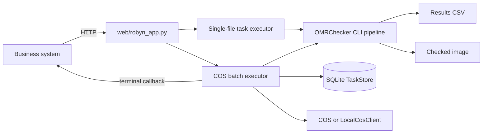
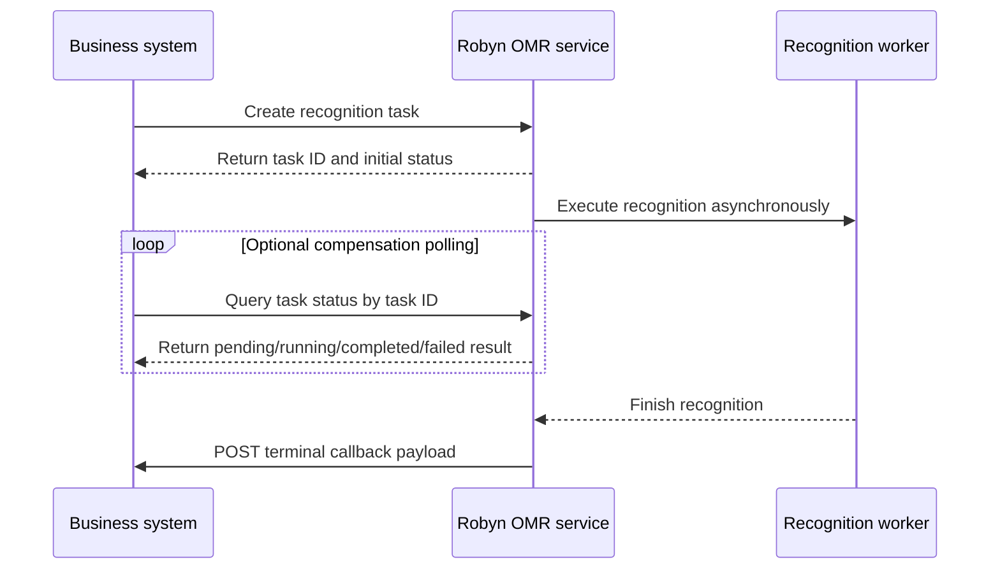

# Robyn Web Service API

This document is the maintained integration guide for the current `web/robyn_app.py` implementation. It describes the API as implemented in code, not a future design.

## Runtime architecture



There are two integration modes:

1. Single-file task API under `/api/omr/tasks`.
2. COS batch API under `/api/omr/batches`, with alias `/api/omr/batch-tasks`.

For business-system integration, prefer the COS batch API when source files already live in object storage.

## Recognition task lifecycle

Yes. The intended integration flow in the current implementation is:



Use the create-task response `task_id` or `taskId` as the only identifier for later status queries:

| Mode | Create recognition task | Query recognition task status | Completion callback |
| --- | --- | --- | --- |
| Single-file upload | `POST /api/omr/tasks` | `GET /api/omr/tasks/{task_id}` | Optional `callback_url` form field. |
| COS batch | `POST /api/omr/batches` or `POST /api/omr/batch-tasks` | `GET /api/omr/batches/{taskId}` | Required `callbackUrl` JSON field. |

Polling is a compensation mechanism. The business system should still support polling because callbacks can fail or arrive late. The terminal callback payload is the same shape as the corresponding task-status query payload at completion or failure.

## Configuration actually used by current code

### Single-file task API

The single-file API uses module-level environment variables read when `web/robyn_app.py` starts:

| Variable | Default | Meaning |
| --- | --- | --- |
| `OMR_SERVICE_PORT` | `8080` | Robyn HTTP port. |
| `OMR_SERVICE_WORKERS` | `1` | Worker count for both single and batch executors. |
| `OMR_SERVICE_DATA_DIR` | `service_data` | Single-task work/output directory root. |
| `OMR_TEMPLATE_DIR` | `inputs` | Template directory copied into uploaded single-task input folders. |

### COS batch API

The batch API uses `load_service_config()` and reads `config/robyn-service.json` if present. It also applies these environment overrides:

| Variable | Overrides |
| --- | --- |
| `OMR_SERVICE_PORT` | `server.port` for process startup. |
| `OMR_SERVICE_WORKERS` | `server.workers` in loaded config, and module executor size. |
| `OMR_SERVICE_DATA_DIR` | `storage.serviceDataDir`. |
| `OMR_TEMPLATE_DIR` | `storage.templateDir`. |
| `OMR_RECOGNITION_DEBUG_ARTIFACTS` | `recognition.debugArtifacts`. |

Use `config/robyn-service.example.json` as the starting point for `config/robyn-service.json`.

For Windows paths with Chinese characters, start with UTF-8 mode:

```cmd
python -X utf8 web\robyn_app.py
```

## Health check

### `GET /health`

Returns the process-level service status.

```bash
curl http://localhost:8080/health
```

Response shape:

```json
{
  "status": "ok",
  "service": "omrchecker-robyn",
  "workers": 1,
  "template_dir": "inputs"
}
```

`template_dir` is the module-level `_TEMPLATE_DIR`, so it reflects `OMR_TEMPLATE_DIR`, not necessarily the full batch `config/robyn-service.json` object.

## Single-file task flow

This flow stores tasks only in process memory. It is useful for direct uploads and simple integration, but task records are lost when the service restarts.

### 1. Create a single-file recognition task

`POST /api/omr/tasks`

Supported input is `multipart/form-data` with at least one file field. The current implementation uses the multipart field name as the saved file name.

Optional form fields:

| Field | Meaning |
| --- | --- |
| `callback_url` | Optional terminal callback URL. Must start with `http://` or `https://`. |
| `external_task_id` | Caller task ID echoed in task records and callbacks. |
| `batch_id` | Caller batch/group ID used by list filtering. |

Example:

```bash
curl -X POST http://localhost:8080/api/omr/tasks \
  -F "sheet.pdf=@/absolute/path/to/sheet.pdf" \
  -F "external_task_id=java-task-001" \
  -F "batch_id=batch-001" \
  -F "callback_url=https://java.example.com/omr/task-callback"
```

Queued response:

```json
{
  "task_id": "a1b2c3...",
  "status": "queued",
  "external_task_id": "java-task-001",
  "batch_id": "batch-001",
  "links": {
    "self": "/api/omr/tasks/a1b2c3..."
  }
}
```

If parsing or preparation fails, the implementation returns a JSON body like:

```json
{"status": "failed", "error": "..."}
```

### 2. Trusted JSON single-task mode

`POST /api/omr/tasks` also accepts JSON with `input_dir`. This does not copy uploaded files. It runs recognition directly against the supplied directory and writes output under `service_data/tasks/<task_id>/output`.

```json
{
  "input_dir": "inputs",
  "task_id": "optional-caller-safe-id"
}
```

This mode is intended for internal smoke tests or trusted servers only.

### 3. Query single-file recognition task status

`GET /api/omr/tasks/{task_id}`

```bash
curl http://localhost:8080/api/omr/tasks/a1b2c3...
```

While the background future is still running, a queued task is presented as `running`.

Completed response shape:

```json
{
  "task_id": "a1b2c3...",
  "status": "completed",
  "created_at": "2026-08-04T10:00:00+00:00",
  "updated_at": "2026-08-04T10:00:03+00:00",
  "started_at": null,
  "completed_at": "2026-08-04T10:00:03+00:00",
  "external_task_id": "java-task-001",
  "batch_id": "batch-001",
  "callback": {
    "url": "https://java.example.com/omr/task-callback",
    "status": "delivered",
    "attempts": 1,
    "last_error": null,
    "last_attempt_at": "2026-08-04T10:00:03+00:00"
  },
  "input_dir": "service_data/tasks/a1b2c3.../input",
  "output_dir": "service_data/tasks/a1b2c3.../output",
  "upload_name": "sheet.pdf",
  "result": {
    "input_dir": "service_data/tasks/a1b2c3.../input",
    "output_dir": "service_data/tasks/a1b2c3.../output",
    "results_csv": "service_data/tasks/a1b2c3.../output/Results/Results_10AM.csv",
    "count": 1,
    "results": [
      {
        "file_id": "sheet.png",
        "input_path": "service_data/tasks/a1b2c3.../input/sheet.pdf",
        "output_path": "service_data/tasks/a1b2c3.../output/CheckedOMRs/sheet.png",
        "score": "0",
        "exam_id": "",
        "answers": {"q1": "A"},
        "weak_marks": [],
        "review_required": false,
        "checked_image_url": "/api/omr/tasks/a1b2c3.../checked-image/sheet.png"
      }
    ]
  },
  "error": null
}
```

Not found response:

```json
{"status": "not_found", "task_id": "a1b2c3..."}
```

### 4. List single-file tasks

`GET /api/omr/tasks`

Supported filters:

| Query parameter | Meaning |
| --- | --- |
| `status` | Exact match, for example `queued`, `running`, `completed`, `failed`. |
| `batch_id` | Exact caller batch ID. |
| `external_task_id` | Exact caller task ID. |
| `limit` | Positive page size, default `50`. |
| `offset` | Non-negative offset, default `0`. |

Example:

```bash
curl "http://localhost:8080/api/omr/tasks?status=completed&batch_id=batch-001&limit=50&offset=0"
```

Response shape:

```json
{
  "total": 1,
  "limit": 50,
  "offset": 0,
  "tasks": [
    {
      "task_id": "a1b2c3...",
      "external_task_id": "java-task-001",
      "batch_id": "batch-001",
      "status": "completed",
      "created_at": "2026-08-04T10:00:00+00:00",
      "updated_at": "2026-08-04T10:00:03+00:00",
      "completed_at": "2026-08-04T10:00:03+00:00",
      "result_count": 1,
      "callback_status": "delivered",
      "links": {"self": "/api/omr/tasks/a1b2c3..."}
    }
  ]
}
```

### 5. Download single-file task artifacts

CSV:

```bash
curl -OJ http://localhost:8080/api/omr/tasks/a1b2c3.../results-csv
```

Checked image:

```bash
curl -OJ http://localhost:8080/api/omr/tasks/a1b2c3.../checked-image/sheet.png
```

If a file does not exist, the implementation returns a JSON `not_found` body.

### 6. Single-file callback behavior

If `callback_url` was provided, the service posts the terminal `GET /api/omr/tasks/{task_id}` payload after completion or failure. It tries up to three times in the background completion callback.

## COS batch flow

The batch flow is persisted in SQLite through `TaskStore`. It is better suited for business-system integration and callback compensation.

### 1. Prepare runtime config

Create `config/robyn-service.json`.

For local fake COS:

```json
{
  "server": {"port": 8080, "workers": 1},
  "storage": {
    "serviceDataDir": "service_data",
    "templateDir": "docs/assets/A3风格模板/template",
    "archivePrefix": "omr-archive"
  },
  "database": {"url": "sqlite:///service_data/omr_service.db"},
  "cos": {"enabled": false, "localRoot": "service_data/cos_mock"},
  "callback": {"maxAttempts": 3, "timeoutSeconds": 10},
  "recognition": {"debugArtifacts": false},
  "archiveRegions": []
}
```

For real COS, set `cos.enabled=true` and fill `region`, `bucket`, `secretId`, and `secretKey`. `${ENV_NAME}` placeholders are resolved from environment variables.

Important implementation detail: batch recognition copies top-level files from `storage.templateDir` into each sheet workdir. Keep `config.json`, `template.json`, and `reference.png` directly in that directory.

### 2. Place source sheets in COS or fake COS

For fake COS, an `osskey` maps to a file below `cos.localRoot`.

Example:

```text
service_data/cos_mock/incoming/exam-001/sheet-001.pdf
```

Use `osskey`:

```text
incoming/exam-001/sheet-001.pdf
```

### 3. Create a COS batch recognition task

`POST /api/omr/batches`

Alias also implemented:

`POST /api/omr/batch-tasks`

Request body fields:

| Field | Required | Meaning |
| --- | --- | --- |
| `examId` | yes | Business exam ID. Must be a non-empty string. |
| `callbackUrl` | yes | Terminal callback URL. Must be a non-empty string. Current validation only checks presence in batch model. |
| `externalBatchId` | no | Caller batch ID. Must be non-empty if supplied. |
| `recognitionConfig` | no | Object. `debugArtifacts` controls debug workdirs. `template` and `config`, when supplied as objects, are written as runtime `template.json` and `config.json`. Other keys are persisted but not interpreted. |
| `recognitionConfig.debugArtifacts` | no | Boolean. Overrides config default for preserving sheet workdirs. |
| `sheets` | yes | Non-empty list of sheet objects. |
| `sheets[].sheetId` | yes | Business sheet ID. |
| `sheets[].osskey` | yes | Source object key to download from COS or fake COS. |
| `sheets[].metadata` | no | Object persisted in request JSON. Current callback response does not echo it as a top-level field. |

Example:

```bash
curl -X POST http://localhost:8080/api/omr/batches \
  -H "Content-Type: application/json" \
  -d '{
    "examId": "exam-001",
    "externalBatchId": "biz-batch-001",
    "callbackUrl": "https://java.example.com/omr/batch-callback",
    "recognitionConfig": {"debugArtifacts": false},
    "sheets": [
      {"sheetId": "sheet-001", "osskey": "incoming/exam-001/sheet-001.pdf"}
    ]
  }'
```

Template-parameter request example based on `docs/assets/自制模板1/template`:

```json
{
  "examId": "exam-001",
  "externalBatchId": "biz-batch-001",
  "callbackUrl": "https://java.example.com/omr/batch-callback",
  "recognitionConfig": {
    "debugArtifacts": false,
    "template": {
      "pageDimensions": [1190, 1682],
      "bubbleDimensions": [29, 18],
      "outputColumns": [
        "id1", "id2", "id3", "id4", "id5", "id6", "id7", "id8",
        "q1", "q2", "q3", "q4", "q5", "q6", "q7", "q8", "q9", "q10", "q11"
      ],
      "preProcessors": [
        {
          "name": "FeatureBasedAlignment",
          "options": {
            "reference": "reference.png",
            "maxFeatures": 2000,
            "goodMatchPercent": 0.25,
            "2d": true
          }
        }
      ],
      "fieldBlocks": {
        "ExamId": {
          "fieldType": "QTYPE_INT",
          "fieldLabels": ["id1..8"],
          "bubbleDimensions": [30, 17],
          "bubblesGap": 27,
          "labelsGap": 44,
          "origin": [777, 396]
        },
        "Q1": {"fieldType": "QTYPE_MCQ4", "fieldLabels": ["q1"], "bubbleDimensions": [29, 18], "bubblesGap": 39, "labelsGap": 0, "origin": [134, 757]},
        "Q2": {"fieldType": "QTYPE_MCQ4", "fieldLabels": ["q2"], "bubbleDimensions": [29, 18], "bubblesGap": 39, "labelsGap": 0, "origin": [337, 757]},
        "Q3": {"fieldType": "QTYPE_MCQ4", "fieldLabels": ["q3"], "bubbleDimensions": [29, 18], "bubblesGap": 39, "labelsGap": 0, "origin": [540, 757]},
        "Q4": {"fieldType": "QTYPE_MCQ4", "fieldLabels": ["q4"], "bubbleDimensions": [29, 18], "bubblesGap": 39, "labelsGap": 0, "origin": [743, 757]},
        "Q5": {"fieldType": "QTYPE_MCQ4", "fieldLabels": ["q5"], "bubbleDimensions": [29, 18], "bubblesGap": 39, "labelsGap": 0, "origin": [946, 757]},
        "Q6": {"fieldType": "QTYPE_MCQ4", "fieldLabels": ["q6"], "bubbleDimensions": [29, 18], "bubblesGap": 39, "labelsGap": 0, "origin": [134, 802]},
        "Q7": {"fieldType": "QTYPE_MCQ4", "fieldLabels": ["q7"], "bubbleDimensions": [29, 18], "bubblesGap": 39, "labelsGap": 0, "origin": [337, 802]},
        "Q8": {"fieldType": "QTYPE_MCQ4", "fieldLabels": ["q8"], "bubbleDimensions": [29, 18], "bubblesGap": 39, "labelsGap": 0, "origin": [540, 802]},
        "Q9": {"fieldType": "QTYPE_MCQ4", "fieldLabels": ["q9"], "multiSelect": true, "bubbleDimensions": [29, 18], "bubblesGap": 39, "labelsGap": 0, "origin": [134, 933]},
        "Q10": {"fieldType": "QTYPE_MCQ4", "fieldLabels": ["q10"], "multiSelect": true, "bubbleDimensions": [29, 18], "bubblesGap": 39, "labelsGap": 0, "origin": [337, 933]},
        "Q11": {"fieldType": "QTYPE_MCQ4", "fieldLabels": ["q11"], "multiSelect": true, "bubbleDimensions": [29, 18], "bubblesGap": 39, "labelsGap": 0, "origin": [540, 933]}
      }
    },
    "config": {
      "dimensions": {
        "display_height": 1682,
        "display_width": 1190,
        "processing_height": 1682,
        "processing_width": 1190
      },
      "outputs": {
        "show_image_level": 0,
        "save_image_level": 0,
        "save_detections": true
      },
      "threshold_params": {
        "GAMMA_LOW": 0.7,
        "MIN_GAP": 30,
        "MIN_JUMP": 25,
        "CONFIDENT_SURPLUS": 5,
        "JUMP_DELTA": 30,
        "PAGE_TYPE_FOR_THRESHOLD": "white"
      },
      "alignment_params": {
        "auto_align": false
      },
      "pdf_params": {
        "pdf_dpi": 144,
        "pdf_page": 1
      },
      "weak_mark_params": {
        "enabled": true,
        "min_gap": 10,
        "max_mean": 215,
        "supported_field_types": ["QTYPE_MCQ4"],
        "exclude_labels": []
      },
      "weak_identifier_params": {
        "enabled": true,
        "labels": [],
        "exclude_labels": [],
        "min_gap": 20,
        "min_delta_from_blank": 25,
        "max_mean": 205,
        "supported_field_types": ["QTYPE_INT"]
      },
      "weak_multi_mark_params": {
        "enabled": true,
        "labels": [],
        "only_when_blank": true,
        "min_delta_from_blank": 10,
        "max_mean": 218,
        "max_marks": 4,
        "full_select_fallback_enabled": true,
        "full_select_max_mean": 170,
        "full_select_min_delta_from_blank": 35,
        "full_select_max_spread": 25
      }
    }
  },
  "sheets": [
    {
      "sheetId": "sheet-001",
      "osskey": "incoming/exam-001/sheet-001.pdf",
      "metadata": {
        "studentId": "202608040001",
        "studentName": "张三"
      }
    }
  ]
}
```

Notes for Java integration:

- The `recognitionConfig.template` and `recognitionConfig.config` object shapes above match the verified files in `docs/assets/自制模板1/template/template.json` and `docs/assets/自制模板1/template/config.json`.
- Current backend validation requires `recognitionConfig` to be an object and `recognitionConfig.debugArtifacts`, when supplied, to be a boolean. When `recognitionConfig.template` or `recognitionConfig.config` is supplied, each must be an object to participate in runtime file generation.
- Runtime behavior: batch recognition first copies top-level files from `storage.templateDir` into each sheet workdir. If `recognitionConfig.template` or `recognitionConfig.config` is provided as an object, the service writes them to `template.json` and `config.json` in that workdir before recognition, so the request parameters override the default template/config files. Keep non-JSON dependencies such as `reference.png` in `storage.templateDir`.

Immediate response is the pending callback payload rendered from stored records:

```json
{
  "taskId": "batch-task-id",
  "examId": "exam-001",
  "status": "pending",
  "aggregateCounts": {"total": 1, "pending": 1},
  "sheets": [
    {
      "sheetId": "sheet-001",
      "osskey": "incoming/exam-001/sheet-001.pdf",
      "sourceOsskey": "incoming/exam-001/sheet-001.pdf",
      "status": "pending",
      "result": {},
      "artifacts": []
    }
  ],
  "externalBatchId": "biz-batch-001"
}
```

If validation fails, response shape is:

```json
{"status": "failed", "error": "callbackUrl is required"}
```

### 4. Batch background processing behavior

After submission, the service starts `_process_batch_safely` in `_BATCH_EXECUTOR`.

For each sheet:

1. Status becomes `running`.
2. Source file is downloaded from `osskey` into `service_data/tasks/<taskId>/sheets/<sheetId>/source/`.
3. Top-level template files from `storage.templateDir` are copied into the sheet workdir.
4. OMR recognition runs against the sheet workdir.
5. The checked image is uploaded to `checked/<taskId>/<sheetId>/<checked-image-name>` when available.
6. If `archiveRegions` are configured, region screenshots are generated from the checked image and uploaded to `artifacts/<taskId>/<sheetId>/<filename>`.
7. Sheet status becomes `completed` or `failed`.
8. Batch status becomes:
   - `completed` when all sheets completed and artifact uploads had no errors.
   - `failed` when no sheet completed.
   - `partial_failed` when at least one sheet completed but some sheet or artifact failed.
9. If debug artifacts are disabled, per-sheet workdirs are removed after processing.
10. If `callbackUrl` exists, terminal callback is attempted and recorded in the database.

### 5. Query COS batch recognition task status

`GET /api/omr/batches/{taskId}`

```bash
curl http://localhost:8080/api/omr/batches/batch-task-id
```

Terminal response shape:

```json
{
  "taskId": "batch-task-id",
  "examId": "exam-001",
  "status": "completed",
  "aggregateCounts": {"total": 1, "completed": 1},
  "sheets": [
    {
      "sheetId": "sheet-001",
      "osskey": "incoming/exam-001/sheet-001.pdf",
      "sourceOsskey": "incoming/exam-001/sheet-001.pdf",
      "status": "completed",
      "result": {
        "file_id": "sheet-001.png",
        "answers": {"q1": "A"},
        "checkedImagePath": "service_data/tasks/.../output/CheckedOMRs/sheet-001.png"
      },
      "artifacts": [],
      "file_id": "sheet-001.png",
      "answers": {"q1": "A"},
      "checkedImagePath": "service_data/tasks/.../output/CheckedOMRs/sheet-001.png",
      "checkedImageOsskey": "checked/batch-task-id/sheet-001/sheet-001.png"
    }
  ],
  "externalBatchId": "biz-batch-001"
}
```

Notes about this response:

- `SheetRecognitionResult.to_callback_dict()` promotes keys from `result` to the sheet top level when `result` is an object.
- If `checkedImageOsskey` is present in stored result, it is promoted to the sheet top level and removed from the nested `result` object.
- If region screenshots were uploaded, `regionImages` appears on the sheet.
- If artifact upload failed, `artifactErrors` appears in the sheet result/top-level promoted fields.

Not found response:

```json
{"status": "not_found", "taskId": "batch-task-id", "error": "batch not found"}
```

### 6. List COS batches

`GET /api/omr/batches`

Supported filters:

| Query parameter | Also accepted | Meaning |
| --- | --- | --- |
| `status` |  | Exact batch status. |
| `examId` | `exam_id` | Exact exam ID. |
| `externalBatchId` | `external_batch_id` | Exact caller batch ID. |
| `limit` |  | Positive page size, default `50`. |
| `offset` |  | Non-negative offset, default `0`. |

Example:

```bash
curl "http://localhost:8080/api/omr/batches?examId=exam-001&status=completed&limit=50&offset=0"
```

Response shape:

```json
{
  "total": 1,
  "limit": 50,
  "offset": 0,
  "batches": [
    {
      "taskId": "batch-task-id",
      "examId": "exam-001",
      "externalBatchId": "biz-batch-001",
      "status": "completed",
      "aggregateCounts": {"total": 1, "completed": 1},
      "sheets": [
        {
          "sheetId": "sheet-001",
          "osskey": "incoming/exam-001/sheet-001.pdf",
          "sourceOsskey": "incoming/exam-001/sheet-001.pdf",
          "status": "completed",
          "result": {"file_id": "sheet-001.png", "answers": {"q1": "A"}},
          "artifacts": [],
          "file_id": "sheet-001.png",
          "answers": {"q1": "A"}
        }
      ],
      "createdAt": "2026-08-04T10:00:00+00:00",
      "updatedAt": "2026-08-04T10:00:03+00:00",
      "completedAt": "2026-08-04T10:00:03+00:00",
      "links": {"self": "/api/omr/batches/batch-task-id"}
    }
  ]
}
```

Current implementation includes `sheets` in each list item by rendering the full batch payload for each batch.

### 7. COS batch callback behavior

For COS batches, the callback payload is the same shape as `GET /api/omr/batches/{taskId}` terminal payload. Callback delivery attempts are persisted in SQLite by `TaskStore.add_callback_attempt()`. The callback attempt records are not currently exposed through a dedicated HTTP endpoint.

Current implementation detail: `callback.timeoutSeconds` is used by `HttpCallbackClient`. `callback.maxAttempts` is loaded into config but is not used by the current COS batch callback sender, so a COS batch terminal callback is attempted once per completed `process_batch()` run.

## Interface summary

| Purpose | Method and path | Persistence | Notes |
| --- | --- | --- | --- |
| Health | `GET /health` | none | Process status only. |
| Submit single task | `POST /api/omr/tasks` | in memory | Multipart upload or trusted JSON `input_dir`. |
| List single tasks | `GET /api/omr/tasks` | in memory | Filters: `status`, `batch_id`, `external_task_id`. |
| Get single task | `GET /api/omr/tasks/{task_id}` | in memory | Returns terminal result or current status. |
| Download single CSV | `GET /api/omr/tasks/{task_id}/results-csv` | filesystem | Uses `result.results_csv`. |
| Download checked image | `GET /api/omr/tasks/{task_id}/checked-image/{file_id}` | filesystem | Uses checked image under task output dir. |
| Submit COS batch | `POST /api/omr/batches` | SQLite | Requires `examId`, `callbackUrl`, non-empty `sheets`. |
| Submit COS batch alias | `POST /api/omr/batch-tasks` | SQLite | Same handler as `/api/omr/batches`. |
| List COS batches | `GET /api/omr/batches` | SQLite | Filters: `status`, `examId`/`exam_id`, `externalBatchId`/`external_batch_id`. |
| Get COS batch | `GET /api/omr/batches/{taskId}` | SQLite | Returns callback-compatible payload. |

## Business-system joint-debug checklist

1. Decide integration mode. Prefer `/api/omr/batches` for platform integration with COS object keys.
2. Prepare `config/robyn-service.json`, including `storage.templateDir`, database URL, COS settings, and callback timeout.
3. Put a verified template directory in `storage.templateDir`. For the current A3 verified template, use `docs/assets/A3风格模板/template` or copy its files to a deployment path.
4. Start the service and verify `GET /health`.
5. For fake COS, place one known-good source file under `service_data/cos_mock/<osskey>`.
6. Submit one-sheet batch request.
7. Poll `GET /api/omr/batches/{taskId}` until status is `completed`, `failed`, or `partial_failed`.
8. Verify `answers` and `checkedImageOsskey` against the expected recognition result.
9. Verify the business callback endpoint receives the same terminal payload.
10. Keep polling/list queries as compensation even when callbacks are enabled.

## Known implementation notes

- `callbackUrl` is required for batch submission by `BatchRecognitionRequest.from_api_json()`.
- `recognitionConfig.template` is accepted and persisted but not currently used to select a template. Template selection comes from `storage.templateDir`.
- Single-file task records are in memory only. COS batch records are persisted in SQLite.
- Single-file callbacks retry up to three times. COS batch callbacks are attempted once in the current code even though `callback.maxAttempts` is loaded.
- Batch list responses include full `sheets`, which may be heavy for large batches.
- There is no OpenAPI/Swagger generation in the current Robyn app.
- There is no authentication or request signing in the current implementation.
- There is no dedicated endpoint for callback attempt history yet.
