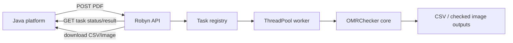

# Robyn Web Service Extension

This branch adds a Web-service layer for OMRChecker so a Java platform can submit PDFs and receive JSON recognition results.

## Goals

- Keep the existing CLI recognition pipeline as the source of truth.
- Add a thin Robyn HTTP API around a framework-independent service module.
- Use asynchronous task submission so Java requests are not blocked by CPU/IO-heavy PDF recognition.
- Return JSON rows, CSV download links, and checked image download links.
- Keep uploaded files and generated outputs isolated per task.
- Support optional callback delivery for long-running recognition tasks.
- Support task execution record queries for compensation and audit.

## Architecture



## Files added

- `src/services/omr_service.py`
  - Framework-independent service wrapper.
  - Copies `config.json` and `template.json` into an isolated task input directory.
  - Runs the existing `entry_point` pipeline.
  - Parses `Results_*.csv` into Java-friendly JSON.
- `web/robyn_app.py`
  - Robyn HTTP API.
  - In-memory task registry.
  - Background `ThreadPoolExecutor` worker.
  - Health check, task submission, task query, CSV download, checked image download.

## API draft

### Health check

```http
GET /health
```

Response:

```json
{
  "status": "ok",
  "service": "omrchecker-robyn",
  "workers": 1,
  "template_dir": "inputs"
}
```

### Submit a PDF or image

```http
POST /api/omr/tasks
Content-Type: multipart/form-data
```

Use one file field. The field name is used as the saved file name.

Optional fields:

- `callback_url`: completion callback endpoint. If supplied, the service posts the terminal task payload to this URL.
- `external_task_id`: caller-side task ID returned in task responses and callbacks.
- `batch_id`: caller-side batch ID used by task list filtering.

Response:

```json
{
  "task_id": "a1b2c3...",
  "external_task_id": "java-task-001",
  "batch_id": "batch-20260802-001",
  "status": "queued",
  "links": {
    "self": "/api/omr/tasks/a1b2c3..."
  }
}
```

For trusted internal testing, JSON requests are also supported:

```json
{
  "input_dir": "inputs"
}
```

### Query task

```http
GET /api/omr/tasks/{task_id}
```

Completed response shape:

```json
{
  "task_id": "a1b2c3...",
  "status": "completed",
  "result": {
    "results_csv": "service_data/tasks/a1b2c3/output/Results/Results_10AM.csv",
    "count": 1,
    "results": [
      {
        "file_id": "MX-M3658N_20260730_123704_003.png",
        "exam_id": "25040311",
        "answers": {
          "q1": "C",
          "q2": "A",
          "q6": "B",
          "q9": "BC",
          "q10": "AD"
        },
        "weak_marks": [],
        "review_required": false,
        "checked_image_url": "/api/omr/tasks/a1b2c3/checked-image/MX-M3658N_20260730_123704_003.png"
      }
    ]
  }
}
```

### Query task execution records

```http
GET /api/omr/tasks?status=completed&batch_id=batch-20260802-001&limit=50&offset=0
```

Response:

```json
{
  "total": 1,
  "limit": 50,
  "offset": 0,
  "tasks": [
    {
      "task_id": "a1b2c3...",
      "external_task_id": "java-task-001",
      "batch_id": "batch-20260802-001",
      "status": "completed",
      "created_at": "2026-08-02T03:20:00+00:00",
      "updated_at": "2026-08-02T03:25:00+00:00",
      "completed_at": "2026-08-02T03:25:00+00:00",
      "result_count": 1,
      "callback_status": "delivered",
      "links": {
        "self": "/api/omr/tasks/a1b2c3..."
      }
    }
  ]
}
```

### Callback payload

When `callback_url` is supplied, the service posts the terminal task payload after completion or failure. The payload matches `GET /api/omr/tasks/{task_id}` and includes caller metadata and callback delivery state.

```json
{
  "task_id": "a1b2c3...",
  "external_task_id": "java-task-001",
  "batch_id": "batch-20260802-001",
  "status": "completed",
  "callback": {
    "url": "https://java.example.com/omr/callback",
    "status": "pending",
    "attempts": 1,
    "last_error": null,
    "last_attempt_at": "2026-08-02T03:25:00+00:00"
  },
  "result": {
    "count": 1,
    "results": []
  },
  "error": null
}
```

`weak_marks` is reserved in the response contract. The current weak-mark fallback writes warning logs in the core detector. A later step should promote those events to structured task results.

### Download checked image

```http
GET /api/omr/tasks/{task_id}/checked-image/{file_id}
```

### Download CSV

```http
GET /api/omr/tasks/{task_id}/results-csv
```

## Run locally

Install dependencies:

```bash
pip install -r requirements.txt
```

Start service:

```bash
python web/robyn_app.py
```

Optional environment variables:

```text
OMR_SERVICE_PORT=8080
OMR_SERVICE_WORKERS=1
OMR_SERVICE_DATA_DIR=service_data
OMR_TEMPLATE_DIR=inputs
```

## Java integration recommendation

- Java submits one PDF per task using multipart upload.
- Java stores `task_id` and polls `GET /api/omr/tasks/{task_id}`.
- Java persists the returned JSON into the platform database.
- Java downloads and stores checked images for human review and audit.
- For high-volume production, replace the in-memory task registry with Redis/database and move recognition workers into separate processes or containers.

## Production notes

Current implementation is a first Web extension, not the final production queue system.

Before production:

1. Add structured weak-mark event collection.
2. Add persistent task storage.
3. Add authentication between Java and the OMR service.
4. Add file size/type limits.
5. Add cleanup policy for `service_data/tasks`.
6. Add container deployment scripts.
7. Add concurrency benchmarks using at least 100-200 real samples.
