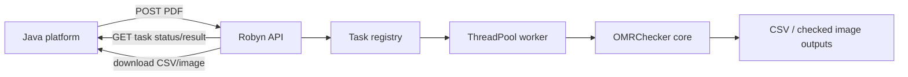

# Robyn Web Service Extension

This branch adds a Web-service layer for OMRChecker so a Java platform can submit PDFs and receive JSON recognition results.

## Goals

- Keep the existing CLI recognition pipeline as the source of truth.
- Add a thin Robyn HTTP API around a framework-independent service module.
- Use asynchronous task submission so Java requests are not blocked by CPU/IO-heavy PDF recognition.
- Return JSON rows, CSV download links, and checked image download links.
- Keep uploaded files and generated outputs isolated per task.
- Support optional callback delivery for long-running recognition tasks.
- Support task execution record queries for compensation and audit.

## Architecture



## Calling workflow

Keep this section as the primary maintained guide for service callers. The root `README.md` links here and should not duplicate the full API flow.

### 1. Check service health

```bash
curl http://localhost:8080/health
```

Expected response includes `status: "ok"`, the service name, worker count, and the active template directory.

### 2. Submit a recognition task

Use multipart upload for normal Java-platform integration. The uploaded file field can be named `file`; optional metadata fields are returned in task records and callback payloads.

```bash
curl -X POST http://localhost:8080/api/omr/tasks \
  -F "file=@/absolute/path/to/sheet.pdf" \
  -F "external_task_id=java-task-001" \
  -F "batch_id=batch-20260802-001" \
  -F "callback_url=https://java.example.com/omr/callback"
```

Response:

```json
{
  "task_id": "a1b2c3...",
  "external_task_id": "java-task-001",
  "batch_id": "batch-20260802-001",
  "status": "queued",
  "links": {
    "self": "/api/omr/tasks/a1b2c3..."
  }
}
```

Store `task_id` on the caller side. It is the service-side identifier for polling, result download, checked-image download, and audit lookup.

### 3. Poll task status and result

```bash
curl http://localhost:8080/api/omr/tasks/a1b2c3...
```

While the task is queued or running, continue polling the same URL. When `status` becomes `completed`, the response includes parsed recognition rows under `result.results`. When `status` becomes `failed`, inspect `error`.

### 4. Query task execution records

Use this endpoint for compensation, audit, dashboard lists, or batch-level reconciliation.

```bash
curl "http://localhost:8080/api/omr/tasks?status=completed&batch_id=batch-20260802-001&limit=50&offset=0"
```

Supported query parameters:

- `status`: filter by task status, for example `queued`, `running`, `completed`, or `failed`.
- `batch_id`: filter by caller batch ID.
- `external_task_id`: filter by caller task ID.
- `limit`: page size. Default is `50`.
- `offset`: page offset. Default is `0`.

### 5. Download generated files

After completion, download the CSV result:

```bash
curl -OJ http://localhost:8080/api/omr/tasks/a1b2c3.../results-csv
```

Each result row can include a `checked_image_url`. Download a checked image with:

```bash
curl -OJ http://localhost:8080/api/omr/tasks/a1b2c3.../checked-image/MX-M3658N_20260730_123704_003.png
```

### 6. Use callback mode for long-running recognition

If `callback_url` is supplied on task submission, the service posts the terminal task payload after completion or failure. Callers should still persist `task_id` and keep polling/query APIs available as compensation paths if callback delivery fails.


### 7. Submit a COS batch recognition task

Use `/api/omr/batches` when the Java platform has already uploaded source sheets to Tencent COS, or when local development uses the filesystem-backed fake COS client. The request body is JSON. Each sheet must provide the business `sheetId` and source object key `osskey`.

Startup configuration can come from `config/robyn-service.json` or environment variables. With `cos.enabled: false`, object storage uses `LocalCosClient` and reads or writes under `cos.localRoot`, which is useful for local smoke tests.

```json
{
  "storage": {
    "serviceDataDir": "service_data",
    "templateDir": "inputs"
  },
  "database": {
    "url": "sqlite:///service_data/omr_service.db"
  },
  "cos": {
    "enabled": false,
    "localRoot": "service_data/cos_mock"
  },
  "archiveRegions": [
    {
      "regionCode": "exam_no",
      "regionName": "准考证号区域",
      "type": "student_id",
      "bbox": [5, 10, 40, 20]
    }
  ]
}
```

Submit a batch:

```bash
curl -X POST http://localhost:8080/api/omr/batches \
  -H 'Content-Type: application/json' \
  -d '{
    "examId": "exam-20260802-001",
    "externalBatchId": "java-batch-001",
    "callbackUrl": "https://java.example.com/omr/batch-callback",
    "recognitionConfig": {"template": "default", "archiveRegionImages": true},
    "sheets": [
      {"sheetId": "sheet-001", "osskey": "incoming/exam-20260802-001/sheet-001.png"}
    ]
  }'
```

Initial response:

```json
{
  "taskId": "svc-batch-id",
  "examId": "exam-20260802-001",
  "externalBatchId": "java-batch-001",
  "status": "pending",
  "aggregateCounts": {"total": 1, "pending": 1},
  "sheets": [
    {
      "sheetId": "sheet-001",
      "osskey": "incoming/exam-20260802-001/sheet-001.png",
      "sourceOsskey": "incoming/exam-20260802-001/sheet-001.png",
      "status": "pending",
      "result": {},
      "artifacts": []
    }
  ],
  "links": {"self": "/api/omr/batches/svc-batch-id"}
}
```

The service downloads each source `osskey`, copies template dependencies into an isolated work directory, runs OMR recognition, uploads the checked image, crops configured large regions from the checked image, uploads those region images, persists all records in SQLite, and posts the terminal callback.

Terminal callback and query payloads include business fields at the sheet level for callers that do not want to inspect the nested `result` or generic `artifacts` arrays:

```json
{
  "taskId": "svc-batch-id",
  "examId": "exam-20260802-001",
  "externalBatchId": "java-batch-001",
  "status": "completed",
  "aggregateCounts": {"total": 1, "completed": 1},
  "sheets": [
    {
      "sheetId": "sheet-001",
      "osskey": "incoming/exam-20260802-001/sheet-001.png",
      "sourceOsskey": "incoming/exam-20260802-001/sheet-001.png",
      "status": "completed",
      "answers": {"q1": "A"},
      "checkedImageOsskey": "checked/svc-batch-id/sheet-001/sheet-001.png",
      "regionImages": [
        {
          "regionCode": "exam_no",
          "regionName": "准考证号区域",
          "type": "student_id",
          "osskey": "artifacts/svc-batch-id/sheet-001/001_sheet-001_exam_no_准考证号区域.png",
          "bbox": {"x": 5, "y": 10, "width": 40, "height": 20},
          "uploadStatus": "uploaded"
        }
      ],
      "result": {
        "answers": {"q1": "A"}
      },
      "artifacts": [
        {
          "artifactType": "region_screenshot",
          "osskey": "artifacts/svc-batch-id/sheet-001/001_sheet-001_exam_no_准考证号区域.png"
        }
      ]
    }
  ]
}
```

If an artifact upload fails, recognition remains per-sheet isolated. The batch becomes `partial_failed` when recognition completed but checked-image or region-image upload failed, and the sheet result includes `artifactErrors` entries with the failed local path, intended `osskey`, and error message.

### 8. Query COS batch records

Use query APIs as callback compensation paths, audit records, and dashboard inputs.

```bash
curl http://localhost:8080/api/omr/batches/svc-batch-id
curl "http://localhost:8080/api/omr/batches?examId=exam-20260802-001&status=completed&externalBatchId=java-batch-001&limit=50&offset=0"
```

Supported list filters are `examId`, `status`, `externalBatchId`, `limit`, and `offset`. Single-batch responses render the same terminal payload shape as callbacks.

### Related interfaces

| Purpose | Method and path | Notes |
| --- | --- | --- |
| Health check | `GET /health` | Verify service is running and see active worker/template settings. |
| Submit recognition task | `POST /api/omr/tasks` | Multipart file upload. Supports optional `callback_url`, `external_task_id`, `batch_id`. |
| Query one task | `GET /api/omr/tasks/{task_id}` | Poll status and retrieve terminal result or error. |
| Query task records | `GET /api/omr/tasks` | Filter by status, batch ID, external task ID, with limit/offset pagination. |
| Download checked image | `GET /api/omr/tasks/{task_id}/checked-image/{file_id}` | Use `checked_image_url` from completed result rows. |
| Download CSV | `GET /api/omr/tasks/{task_id}/results-csv` | Available after the task has produced `Results_*.csv`. |


## Files added

- `src/services/omr_service.py`
  - Framework-independent service wrapper.
  - Copies `config.json` and `template.json` into an isolated task input directory.
  - Runs the existing `entry_point` pipeline.
  - Parses `Results_*.csv` into Java-friendly JSON.
- `web/robyn_app.py`
  - Robyn HTTP API.
  - In-memory task registry.
  - Background `ThreadPoolExecutor` worker.
  - Health check, task submission, task query, CSV download, checked image download.

## API draft

### Health check

```http
GET /health
```

Response:

```json
{
  "status": "ok",
  "service": "omrchecker-robyn",
  "workers": 1,
  "template_dir": "inputs"
}
```

### Submit a PDF or image

```http
POST /api/omr/tasks
Content-Type: multipart/form-data
```

Use one file field. The field name is used as the saved file name.

Optional fields:

- `callback_url`: completion callback endpoint. If supplied, the service posts the terminal task payload to this URL.
- `external_task_id`: caller-side task ID returned in task responses and callbacks.
- `batch_id`: caller-side batch ID used by task list filtering.

Response:

```json
{
  "task_id": "a1b2c3...",
  "external_task_id": "java-task-001",
  "batch_id": "batch-20260802-001",
  "status": "queued",
  "links": {
    "self": "/api/omr/tasks/a1b2c3..."
  }
}
```

For trusted internal testing, JSON requests are also supported:

```json
{
  "input_dir": "inputs"
}
```

### Query task

```http
GET /api/omr/tasks/{task_id}
```

Completed response shape:

```json
{
  "task_id": "a1b2c3...",
  "status": "completed",
  "result": {
    "results_csv": "service_data/tasks/a1b2c3/output/Results/Results_10AM.csv",
    "count": 1,
    "results": [
      {
        "file_id": "MX-M3658N_20260730_123704_003.png",
        "exam_id": "25040311",
        "answers": {
          "q1": "C",
          "q2": "A",
          "q6": "B",
          "q9": "BC",
          "q10": "AD"
        },
        "weak_marks": [],
        "review_required": false,
        "checked_image_url": "/api/omr/tasks/a1b2c3/checked-image/MX-M3658N_20260730_123704_003.png"
      }
    ]
  }
}
```

### Query task execution records

```http
GET /api/omr/tasks?status=completed&batch_id=batch-20260802-001&limit=50&offset=0
```

Response:

```json
{
  "total": 1,
  "limit": 50,
  "offset": 0,
  "tasks": [
    {
      "task_id": "a1b2c3...",
      "external_task_id": "java-task-001",
      "batch_id": "batch-20260802-001",
      "status": "completed",
      "created_at": "2026-08-02T03:20:00+00:00",
      "updated_at": "2026-08-02T03:25:00+00:00",
      "completed_at": "2026-08-02T03:25:00+00:00",
      "result_count": 1,
      "callback_status": "delivered",
      "links": {
        "self": "/api/omr/tasks/a1b2c3..."
      }
    }
  ]
}
```

### Callback payload

When `callback_url` is supplied, the service posts the terminal task payload after completion or failure. The payload matches `GET /api/omr/tasks/{task_id}` and includes caller metadata and callback delivery state.

```json
{
  "task_id": "a1b2c3...",
  "external_task_id": "java-task-001",
  "batch_id": "batch-20260802-001",
  "status": "completed",
  "callback": {
    "url": "https://java.example.com/omr/callback",
    "status": "pending",
    "attempts": 1,
    "last_error": null,
    "last_attempt_at": "2026-08-02T03:25:00+00:00"
  },
  "result": {
    "count": 1,
    "results": []
  },
  "error": null
}
```

`weak_marks` is reserved in the response contract. The current weak-mark fallback writes warning logs in the core detector. A later step should promote those events to structured task results.

### Download checked image

```http
GET /api/omr/tasks/{task_id}/checked-image/{file_id}
```

### Download CSV

```http
GET /api/omr/tasks/{task_id}/results-csv
```

## Run locally

Install dependencies:

```bash
pip install -r requirements.txt
```

Start service:

```bash
python web/robyn_app.py
```

Optional environment variables:

```text
OMR_SERVICE_PORT=8080
OMR_SERVICE_WORKERS=1
OMR_SERVICE_DATA_DIR=service_data
OMR_TEMPLATE_DIR=inputs
```

## Java integration recommendation

- Java submits one PDF per task using multipart upload.
- Java stores `task_id` and polls `GET /api/omr/tasks/{task_id}`.
- Java persists the returned JSON into the platform database.
- Java downloads and stores checked images for human review and audit.
- For high-volume production, replace the in-memory task registry with Redis/database and move recognition workers into separate processes or containers.

## Production notes

Current implementation is a first Web extension, not the final production queue system.

Before production:

1. Add structured weak-mark event collection.
2. Add persistent task storage.
3. Add authentication between Java and the OMR service.
4. Add file size/type limits.
5. Add cleanup policy for `service_data/tasks`.
6. Add container deployment scripts.
7. Add concurrency benchmarks using at least 100-200 real samples.
