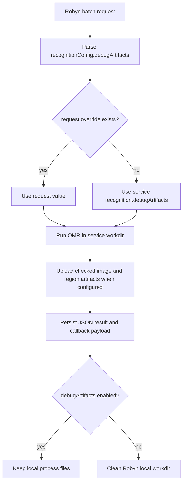

# 2026-08-02 Robyn API debug artifacts design

## 背景

当前 OMRChecker 识别流程会在输出目录中生成 `Results`、`CheckedOMRs`、中间图片和区域截图等过程文件。命令行调试场景依赖这些文件，因此不能改变原项目最开始的 CLI 调试方式。

Robyn 接口场景的主要目标不同：调用方需要 JSON 识别结果，生产环境不希望每次接口调用都长期保留过程文件。过程文件只应在排查、优化识别、复现实验时按配置开启。

## 目标

1. Robyn API 默认只返回识别 JSON 结果，不长期保留每次识别的过程目录。
2. 通过服务配置控制是否保留过程文件。
3. 通过单次 batch 请求覆盖服务默认值，便于只排查某个批次。
4. 不改变 `main.py`、CLI、现有本地调试方式和 `run_omr_directory` 的默认输出行为。
5. 保留已经上传到 COS 的业务产物引用，例如 `checkedImageOsskey` 和 `regionImages`。

## 非目标

1. 不删除或重构 CLI 输出目录设计。
2. 不改变现有 OMR 识别算法。
3. 不改变 callback payload 的业务字段。
4. 不做异步清理任务或保留周期策略。第一阶段只在 Robyn batch 处理完成后即时清理本地工作目录。

## 配置设计

新增服务配置段：

```json
{
  "recognition": {
    "debugArtifacts": false
  }
}
```

含义：

- `false`：Robyn API 默认清理本地识别工作目录，只保留 JSON 结果和已上传的 COS 对象引用。
- `true`：Robyn API 保留本地识别工作目录，便于排查。

新增环境变量覆盖：

```bash
OMR_RECOGNITION_DEBUG_ARTIFACTS=true
```

布尔解析接受 `1`、`true`、`yes`、`on` 表示开启，`0`、`false`、`no`、`off` 表示关闭。非法值应失败而不是静默误配。

## 请求级覆盖

`/api/omr/batches` 请求允许可选字段：

```json
{
  "examId": "exam-001",
  "callbackUrl": "https://example.test/callback",
  "recognitionConfig": {
    "debugArtifacts": true
  },
  "sheets": [
    {"sheetId": "sheet-1", "osskey": "incoming/sheet-1.png"}
  ]
}
```

规则：

1. 未传 `recognitionConfig.debugArtifacts` 时使用服务配置。
2. 传入 `true` 时保留该 batch 的本地过程目录。
3. 传入 `false` 时清理该 batch 的本地过程目录，即使服务配置默认开启。
4. 非布尔类型应返回请求校验错误。

## 清理范围

Robyn batch 当前会为每个 sheet 创建独立工作目录，包含下载的输入图片、模板依赖、OMR 输出、区域截图等。默认关闭 debug artifacts 时，batch 处理完成后清理该 batch 或 sheet 的本地工作目录。

清理不应影响：

- callback payload 中已经形成的 JSON 字段。
- 已经上传到 COS 的 checked image 和 region images。
- 数据库或任务存储中的批次记录。
- CLI 调试输出目录。

清理失败不应把识别结果改为失败。应记录 `artifactCleanupError` 或相似元数据，便于后续排查，同时 callback 仍按识别结果状态发送。

## 数据流



## Testing strategy

1. Service config tests:
   - default `recognition.debugArtifacts` is `false`。
   - JSON config can enable it。
   - env var can override it。
   - invalid env var fails。

2. Batch model tests:
   - `recognitionConfig.debugArtifacts` parses to `True`、`False`、`None`。
   - non-boolean values are rejected。
   - existing request payloads without the field remain valid。

3. Batch service tests:
   - default service config cleans local process directories after terminal result。
   - request override `true` preserves local process directories。
   - request override `false` cleans even when service config enables preservation。
   - cleanup failure is non-fatal and visible in result metadata。

4. Regression guard:
   - `run_omr_directory` still writes to the provided output directory and does not clean it by default。
   - CLI code path is not routed through the new cleanup behavior。

## Acceptance criteria

1. Robyn API default behavior returns JSON and does not leave per-call local process files behind.
2. `recognition.debugArtifacts=true` preserves local artifacts for debugging.
3. Request-level override works both ways.
4. CLI/local debugging behavior is unchanged.
5. Focused tests and syntax checks pass.
