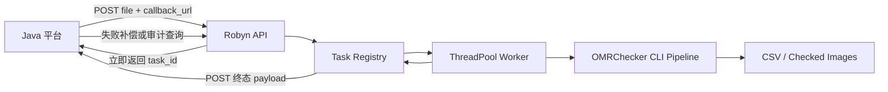

# 2026-08-02 Robyn 批量识别回调与任务记录设计

## 背景

当前 `robyn-web-service` 分支已有基础 Web 服务：

- `web/robyn_app.py` 提供 Robyn HTTP API。
- `src/services/omr_service.py` 封装现有 CLI 识别流程。
- `POST /api/omr/tasks` 异步提交任务。
- `GET /api/omr/tasks/{task_id}` 查询任务状态和结果。
- `GET /api/omr/tasks/{task_id}/checked-image/{file_id}` 下载检查图。
- `GET /api/omr/tasks/{task_id}/results-csv` 下载 CSV。

识别耗时较长，Java 平台不应长连接等待识别完成。已确认接口结构应以异步任务为主，并增加回调返回识别结果和任务执行记录查询能力。

## 目标

- 保持 Robyn 作为 Web 框架。
- 保持现有 CLI 识别流程作为识别事实来源。
- 提交任务后立即返回 `task_id`。
- 支持调用方传入 `callback_url`，识别完成或失败后主动回调。
- 保留任务查询接口，作为回调失败、人工排查和平台补偿机制。
- 后续支持查询任务执行记录，不只查内存中的当前任务。
- 先定义稳定接口结构，再做后续性能、队列和持久化优化。

## 非目标

- 本阶段不替换 Robyn。
- 本阶段不改 OMR 识别算法。
- 本阶段不要求同步返回完整识别结果。
- 本阶段不直接接入生产数据库。
- 本阶段不做复杂任务调度系统，只保留可平滑升级的接口结构。

## 当前实现核对

本地文档 `docs/robyn-web-service.md` 与代码基本一致：

| 能力 | 文档 | 当前代码 | 结论 |
| --- | --- | --- | --- |
| 健康检查 | `GET /health` | 已实现 | 一致 |
| 异步任务提交 | `POST /api/omr/tasks` | 已实现 | 一致 |
| 任务详情查询 | `GET /api/omr/tasks/:task_id` | 已实现 | 一致 |
| CSV 下载 | `GET /api/omr/tasks/:task_id/results-csv` | 已实现 | 一致 |
| checked image 下载 | `GET /api/omr/tasks/:task_id/checked-image/:file_id` | 已实现 | 一致 |
| 任务列表和执行记录 | 未定义 | 未实现 | 需要补充 |
| callback 回调 | 未定义 | 未实现 | 需要补充 |
| 批量多文件语义 | 文档建议 one PDF per task | 当前取第一个上传文件 | 需要明确 |

## 推荐接口结构

### 1. 提交识别任务

```http
POST /api/omr/tasks
Content-Type: multipart/form-data
```

支持字段：

- `file`：上传的 PDF 或图片。第一阶段建议一个 task 对应一个 PDF 或图片。
- `callback_url`：可选。任务完成或失败后，服务主动向该地址 POST 结果。
- `external_task_id`：可选。Java 平台侧任务 ID，回调和查询结果原样返回，便于对账。
- `batch_id`：可选。Java 平台侧批次 ID，用于后续任务记录查询。

响应：

```json
{
  "task_id": "a1b2c3...",
  "external_task_id": "java-task-001",
  "batch_id": "batch-20260802-001",
  "status": "queued",
  "links": {
    "self": "/api/omr/tasks/a1b2c3..."
  }
}
```

### 2. 查询单个任务

```http
GET /api/omr/tasks/{task_id}
```

queued/running 响应应包含：

```json
{
  "task_id": "a1b2c3...",
  "external_task_id": "java-task-001",
  "batch_id": "batch-20260802-001",
  "status": "running",
  "created_at": "2026-08-02T03:20:00Z",
  "updated_at": "2026-08-02T03:21:00Z",
  "started_at": "2026-08-02T03:20:10Z",
  "completed_at": null,
  "callback": {
    "url": "https://java.example.com/omr/callback",
    "status": "pending",
    "attempts": 0,
    "last_error": null
  },
  "result": null,
  "error": null
}
```

completed 响应应包含完整识别结果：

```json
{
  "task_id": "a1b2c3...",
  "external_task_id": "java-task-001",
  "batch_id": "batch-20260802-001",
  "status": "completed",
  "created_at": "2026-08-02T03:20:00Z",
  "updated_at": "2026-08-02T03:25:00Z",
  "started_at": "2026-08-02T03:20:10Z",
  "completed_at": "2026-08-02T03:25:00Z",
  "callback": {
    "url": "https://java.example.com/omr/callback",
    "status": "delivered",
    "attempts": 1,
    "last_error": null
  },
  "result": {
    "results_csv": "service_data/tasks/a1b2c3/output/Results/Results_10AM.csv",
    "count": 1,
    "results": []
  },
  "error": null
}
```

failed 响应应保留错误信息：

```json
{
  "task_id": "a1b2c3...",
  "status": "failed",
  "completed_at": "2026-08-02T03:25:00Z",
  "callback": {
    "url": "https://java.example.com/omr/callback",
    "status": "failed",
    "attempts": 3,
    "last_error": "HTTP 500"
  },
  "result": null,
  "error": "recognition failed: ..."
}
```

### 3. 回调 payload

Robyn 服务在任务进入终态后向 `callback_url` 发送：

```http
POST {callback_url}
Content-Type: application/json
```

payload 与 `GET /api/omr/tasks/{task_id}` 的终态响应保持一致。这样 Java 平台可复用同一套 DTO。

回调规则：

- 只在终态回调：`completed` 或 `failed`。
- 默认最多重试 3 次。
- 每次回调记录 `attempts`、`last_error`、`last_attempt_at`。
- 回调失败不改变识别任务终态，任务仍可通过查询接口补偿获取。
- `callback_url` 只允许 `http://` 或 `https://`，后续生产环境应增加白名单或签名认证。

### 4. 查询任务执行记录

```http
GET /api/omr/tasks
```

查询参数：

- `status`：可选，`queued|running|completed|failed`。
- `batch_id`：可选。
- `external_task_id`：可选。
- `created_from` / `created_to`：可选。
- `limit`：可选，默认 50。
- `offset`：可选，默认 0。

响应：

```json
{
  "total": 1,
  "limit": 50,
  "offset": 0,
  "tasks": [
    {
      "task_id": "a1b2c3...",
      "external_task_id": "java-task-001",
      "batch_id": "batch-20260802-001",
      "status": "completed",
      "created_at": "2026-08-02T03:20:00Z",
      "updated_at": "2026-08-02T03:25:00Z",
      "completed_at": "2026-08-02T03:25:00Z",
      "result_count": 1,
      "callback_status": "delivered",
      "links": {
        "self": "/api/omr/tasks/a1b2c3..."
      }
    }
  ]
}
```

任务列表默认不返回完整 `result.results`，避免大 payload。调用方需要详情时再查单个 task。

## 数据流



## 存储策略

### 第一阶段

- 继续使用内存 `_TASKS`，快速验证接口结构。
- 在内存 task 对象中补充 `callback`、`external_task_id`、`batch_id`、`started_at`、`completed_at`。
- `GET /api/omr/tasks` 从内存 registry 过滤返回。

### 第二阶段

- 增加轻量持久化，比如 SQLite 或 JSONL。
- 保存任务元数据、状态变化、错误、回调尝试记录。
- 大结果文件仍保存在 `service_data/tasks/{task_id}/output`。

### 生产阶段

- 任务状态进入 Java 平台 DB、Redis 或独立队列系统。
- 识别 worker 可拆成独立进程或容器。
- 回调增加签名、超时配置、白名单和幂等处理。

## 批量语义

第一阶段建议维持“一个 PDF 或图片对应一个 task”。如果一个 PDF 内含多页，仍由现有 OMRChecker 输出多条结果 row。

后续如果 Java 平台需要一次上传多个文件，应增加 `batch_id` 聚合，而不是把多个文件强塞进一个 task：

- 每个文件一个 `task_id`。
- 多个 task 共享同一个 `batch_id`。
- Java 可通过 `GET /api/omr/tasks?batch_id=...` 查询整批执行记录。

这样失败隔离更好，也便于重试单个文件。

## 错误处理

- 上传参数错误返回 JSON：`status=failed`，包含 `error`。
- 识别异常时 task 进入 `failed`，保留 `error`。
- 回调异常只影响 `callback.status`，不覆盖识别状态。
- 任务不存在时返回 `status=not_found` 和 `task_id`。
- CSV 或 checked image 不存在时返回 `status=not_found` 和文件类型信息。

## 测试与验收

### 结构验收

- `POST /api/omr/tasks` 支持不带 callback 的旧调用。
- `POST /api/omr/tasks` 支持带 `callback_url`、`external_task_id`、`batch_id`。
- `GET /api/omr/tasks/{task_id}` 在 queued、running、completed、failed 状态下结构稳定。
- 终态回调 payload 与任务详情终态响应结构一致。
- 回调失败后仍可查询到完整任务结果或错误。
- `GET /api/omr/tasks` 可按 `status`、`batch_id`、`external_task_id` 过滤。
- 任务列表不返回完整大结果，只返回摘要。

### 兼容验收

- 原有 `GET /health` 不变。
- 原有 `GET /api/omr/tasks/{task_id}` 仍返回 `result`。
- 原有 `GET /api/omr/tasks/{task_id}/results-csv` 不变。
- 原有 `GET /api/omr/tasks/{task_id}/checked-image/{file_id}` 不变。
- 不改变 `src.entry.entry_point` 和识别算法。

## 后续实施顺序

1. 为 Robyn 层增加 callback 和任务记录字段的单元测试。
2. 增加任务列表过滤的纯函数或小 helper，先不引入数据库。
3. 修改 `create_task` 解析 `callback_url`、`external_task_id`、`batch_id`。
4. 修改 `_complete_task` 记录终态时间，并触发回调。
5. 增加回调发送 helper，包含超时、重试和错误记录。
6. 增加 `GET /api/omr/tasks` 列表接口。
7. 用 stub/mock 的 `run_omr_directory` 和本地 callback server 做结构验证。
8. 通过本地文档样例和现有 service wrapper 验证兼容性。
