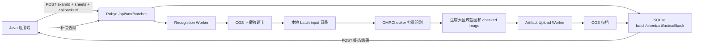

# 2026-08-02 Robyn COS 批量识别设计

## 背景

现有 Robyn 服务已经验证了 HTTP 异步识别链路：创建任务、后台识别、轮询查询、CSV/标记图下载、终态回调。当前接口以单文件上传或可信目录输入为主，任务记录保存在进程内存中。

下一阶段需要对接 Java 应用端和 COS。Java 应用端会按考试维度提交需要识别的答题卡集合。每张答题卡以 COS 对象 key 表示，并携带应用端业务 `sheetId`。识别服务下载这些答题卡，执行批量识别，识别完成后通过回调把识别结果、业务关联字段、归档截图 COS key 一起返回。

## 目标

- 新增独立 Robyn 服务配置文件，用于服务端口、worker、路径、SQLite、COS、回调等服务级配置。
- 集成 COS 客户端，支持按 `osskey` 下载答题卡文档，支持上传人工审查用区域截图和整张标记图。
- 新增考试批量识别接口，按 `examId + sheets[]` 建模。
- 请求中的业务字段必须原样持久化并在查询和回调中返回，包括 `examId`、`externalBatchId`、`sheetId`、`osskey`、`recognitionConfig`。
- 识别完成后返回结构化 JSON，参考 `docs/superpowers/specs/2026-08-01-service-json-result-review-design.md`。
- 支持按大区域归档截图，例如准考证号区域、单选题区域、多选题区域。不要按每道题或每个字段生成截图。
- 使用 SQLite 持久化批次、sheet 明细、截图归档、回调状态，避免服务重启后任务记录丢失。
- 保留现有 `/api/omr/tasks` 单文件接口用于兼容、调试和小规模测试。

## 非目标

- 第一阶段不实现 Java 端动态维护完整 OMRChecker 模板并立即影响识别。`recognitionConfig` 先持久化、透传、回调原样返回。
- 第一阶段不做分布式队列、Redis、独立 worker 集群。
- 第一阶段不把 PDF、图片、区域截图二进制内容存入数据库。
- 第一阶段不要求截图上传失败导致识别失败。截图归档失败应单独记录，不覆盖识别结果。
- 第一阶段不按每题或每个选项 bubble 生成截图。

## 推荐方案

采用“Robyn API + SQLite 任务库 + COS 下载/上传客户端 + 后台识别 worker + 异步归档上传”的结构。



## 服务配置文件

新增独立服务配置，不复用 `inputs/config.json`。`inputs/config.json` 仍然表示识别算法配置。

建议文件：

- `config/robyn-service.example.json`：提交到仓库，展示配置结构。
- `config/robyn-service.json`：本地真实配置，包含真实部署值，建议加入 `.gitignore`。
- `src/services/service_config.py`：加载、校验、环境变量占位符解析。

启动方式：

```bash
python3 web/robyn_app.py --config config/robyn-service.json
```

环境变量可以覆盖关键配置，方便容器部署。例如 `OMR_SERVICE_PORT` 覆盖 `server.port`。

示例配置：

```json
{
  "server": {
    "host": "0.0.0.0",
    "port": 8080,
    "workers": 1
  },
  "storage": {
    "serviceDataDir": "service_data",
    "templateDir": "inputs",
    "taskRetentionDays": 30,
    "archivePrefix": "omr-archive"
  },
  "database": {
    "url": "sqlite:///service_data/omr_service.db"
  },
  "cos": {
    "enabled": true,
    "region": "ap-guangzhou",
    "bucket": "example-bucket-1250000000",
    "secretId": "${COS_SECRET_ID}",
    "secretKey": "${COS_SECRET_KEY}",
    "scheme": "https",
    "downloadTimeoutSeconds": 60,
    "uploadTimeoutSeconds": 60
  },
  "callback": {
    "maxAttempts": 3,
    "timeoutSeconds": 10,
    "signingSecret": "${OMR_CALLBACK_SECRET}"
  },
  "archiveRegions": [
    {
      "regionCode": "candidateNumber",
      "regionName": "准考证号区域",
      "type": "CANDIDATE_NUMBER",
      "bbox": [760, 360, 360, 360]
    },
    {
      "regionCode": "singleChoice",
      "regionName": "单选题区域",
      "type": "SINGLE_CHOICE",
      "bbox": [100, 700, 1050, 180]
    },
    {
      "regionCode": "multiChoice",
      "regionName": "多选题区域",
      "type": "MULTI_CHOICE",
      "bbox": [100, 900, 650, 160]
    }
  ]
}
```

`archiveRegions[].bbox` 使用对齐后的标准答题卡坐标，格式为 `[x, y, width, height]`。这样坐标稳定，不依赖原始扫描件偏移。

## 批量提交接口

新增：

```http
POST /api/omr/batches
Content-Type: application/json
```

请求：

```json
{
  "examId": "exam-20260802-001",
  "externalBatchId": "java-batch-001",
  "callbackUrl": "https://java.example.com/omr/callback",
  "recognitionConfig": {
    "templateId": "default",
    "configVersion": "2026-08-02",
    "options": {},
    "archiveRegionImages": true
  },
  "sheets": [
    {
      "sheetId": "sheet-001",
      "osskey": "omr/exam-001/sheets/001.pdf"
    },
    {
      "sheetId": "sheet-002",
      "osskey": "omr/exam-001/sheets/002.pdf"
    }
  ]
}
```

校验规则：

- `examId` 必填，非空字符串。
- `sheets` 必填，非空数组。
- 每个 `sheet.sheetId` 必填，非空字符串，同一批次内不可重复。
- 每个 `sheet.osskey` 必填，非空字符串。
- `callbackUrl` 可选。如果存在，只允许 `http://` 或 `https://`。
- `recognitionConfig` 可选。第一阶段只保存和透传，不覆盖 OMRChecker 运行配置。
- `recognitionConfig.archiveRegionImages` 缺省为服务配置默认值。

响应：

```json
{
  "batchId": "svc-batch-id",
  "examId": "exam-20260802-001",
  "externalBatchId": "java-batch-001",
  "status": "queued",
  "itemCount": 2,
  "links": {
    "self": "/api/omr/batches/svc-batch-id"
  }
}
```

## 查询接口

单批次查询：

```http
GET /api/omr/batches/{batchId}
```

批次列表：

```http
GET /api/omr/batches?examId=exam-20260802-001&status=completed&limit=50&offset=0
```

下载本地标记图继续保留 HTTP 兜底能力：

```http
GET /api/omr/batches/{batchId}/checked-image/{sheetId}
```

生产回调优先返回 `checkedImageOsskey` 和区域截图 `osskey`，HTTP 下载接口只作为调试和补偿。

## 状态模型

批次状态：

- `queued`：批次已创建，等待 worker。
- `running`：正在下载、识别或上传归档。
- `completed`：所有 sheet 处理完成，且没有 sheet 失败。
- `partial_failed`：部分 sheet 失败，部分成功。
- `failed`：全部 sheet 失败，或批次级错误导致无法执行。

Sheet 状态：

- `queued`
- `downloading`
- `recognizing`
- `uploading_artifacts`
- `completed`
- `failed`

识别状态 `recognitionStatus` 参考昨晚结果文档：

- `ACCEPTED`
- `NEEDS_REVIEW`
- `LOW_CONFIDENCE`
- `ID_REVIEW`
- `FAILED`

## 本地目录结构

```text
service_data/
  omr_service.db
  batches/
    {batchId}/
      input/
        {sheetId}.pdf
        config.json
        template.json
        reference.png
      output/
        Results/Results_*.csv
        CheckedOMRs/*.png
      artifacts/
        {sheetId}/
          checked.png
          regions/
            candidateNumber.png
            singleChoice.png
            multiChoice.png
```

运行时需要复制模板目录下的必需文件，包括 `config.json`、`template.json`、`evaluation.json` 以及模板预处理器依赖的资源，例如 `reference.png`。之前调试已证明当前模板启用 `FeatureBasedAlignment` 时缺少 `reference.png` 会导致 OpenCV resize 失败。

## COS 客户端

新增 `CosDocumentClient`，封装腾讯 COS SDK：

- `download_file(osskey, local_path)`
- `upload_file(local_path, osskey, content_type=None)`
- `build_archive_osskey(exam_id, batch_id, sheet_id, relative_artifact_path)`

下载源文件路径保持应用端传入的 `osskey`。

归档上传路径建议：

```text
{archivePrefix}/{examId}/{batchId}/{sheetId}/checked.png
{archivePrefix}/{examId}/{batchId}/{sheetId}/regions/{regionCode}.png
```

示例：

```text
omr-archive/exam-20260802-001/svc-batch-id/sheet-001/regions/candidateNumber.png
omr-archive/exam-20260802-001/svc-batch-id/sheet-001/regions/singleChoice.png
omr-archive/exam-20260802-001/svc-batch-id/sheet-001/regions/multiChoice.png
```

## 区域截图设计

区域截图按业务大区域生成，不按题号、字段或选项逐个生成。

第一阶段支持：

- 准考证号区域：`CANDIDATE_NUMBER`
- 单选题区域：`SINGLE_CHOICE`
- 多选题区域：`MULTI_CHOICE`

区域来源：

1. 优先使用请求中的 `recognitionConfig.archiveRegions`。
2. 如果请求没有传，则使用服务配置 `archiveRegions`。
3. 如果两者都没有，跳过区域截图，只保留整张 checked image。

裁剪坐标基于对齐后的标准答题卡图像。由于当前流程会输出 CheckedOMRs 标记图，第一阶段可以从 checked image 或对齐后的处理图裁剪。为了人工审查直观，建议从 checked image 裁剪。后续如果需要无标记原图，可增加 `regionImageMode: checked|aligned|both`。

返回结构：

```json
"regionImages": [
  {
    "regionCode": "candidateNumber",
    "regionName": "准考证号区域",
    "type": "CANDIDATE_NUMBER",
    "osskey": "omr-archive/exam-001/batch-abc/sheet-001/regions/candidateNumber.png",
    "bbox": [760, 360, 360, 360],
    "uploadStatus": "uploaded",
    "error": null
  }
]
```

## 异步归档上传

识别 worker 负责生成本地 artifact 文件，上传交给 artifact upload worker。批次回调前等待上传任务结束，或等待到配置的最大超时时间。

推荐第一阶段规则：

- 识别结果成功与否由 OMR 识别决定。
- 截图上传失败不把 sheet 识别状态改为 failed。
- 上传失败记录在 `artifactUploadStatus` 和 `artifactErrors` 中。
- 回调可以在截图上传完成后发送。如果上传超时，则发送已有上传结果和失败明细。

Sheet 级 artifact 状态：

- `not_requested`
- `pending`
- `uploading`
- `uploaded`
- `partial_failed`
- `failed`

## 回调 payload

回调与 `GET /api/omr/batches/{batchId}` 的终态结果保持同构，便于 Java 使用同一 DTO。

```json
{
  "schemaVersion": "omr-batch-result.v1",
  "batchId": "svc-batch-id",
  "examId": "exam-20260802-001",
  "externalBatchId": "java-batch-001",
  "status": "completed",
  "createdAt": "2026-08-02T06:30:00Z",
  "completedAt": "2026-08-02T06:35:00Z",
  "recognitionConfig": {
    "templateId": "default",
    "configVersion": "2026-08-02",
    "options": {},
    "archiveRegionImages": true
  },
  "summary": {
    "total": 2,
    "completed": 2,
    "failed": 0,
    "needsReview": 0
  },
  "sheets": [
    {
      "sheetId": "sheet-001",
      "osskey": "omr/exam-001/sheets/001.pdf",
      "status": "completed",
      "recognitionStatus": "ACCEPTED",
      "examIdFromSheet": "23254519",
      "answers": {
        "q1": "ABCD",
        "q2": "ABD"
      },
      "items": [],
      "reviews": [],
      "regionImages": [
        {
          "regionCode": "candidateNumber",
          "regionName": "准考证号区域",
          "type": "CANDIDATE_NUMBER",
          "osskey": "omr-archive/exam-20260802-001/svc-batch-id/sheet-001/regions/candidateNumber.png",
          "bbox": [760, 360, 360, 360],
          "uploadStatus": "uploaded",
          "error": null
        }
      ],
      "checkedImageOsskey": "omr-archive/exam-20260802-001/svc-batch-id/sheet-001/checked.png",
      "checkedImageUrl": "/api/omr/batches/svc-batch-id/checked-image/sheet-001",
      "artifactUploadStatus": "uploaded",
      "artifactErrors": [],
      "error": null
    }
  ],
  "errors": []
}
```

命名约定：对外 HTTP JSON 使用 camelCase。Python 内部可以使用 snake_case，但边界转换必须集中处理。

业务字段区分：

- 请求业务考试 ID 使用 `examId`，顶层原样返回。
- 答题卡识别出来的准考证号使用 `examIdFromSheet`，避免与业务考试 ID 混淆。
- `sheetId` 和 `osskey` 每条 sheet 原样返回。

## SQLite 持久化

建议最小表结构：

### `omr_batches`

- `batch_id` text primary key
- `exam_id` text not null
- `external_batch_id` text
- `callback_url` text
- `recognition_config_json` text
- `status` text not null
- `summary_json` text
- `error` text
- `created_at` text not null
- `updated_at` text not null
- `completed_at` text
- `callback_status` text
- `callback_attempts` integer
- `callback_last_error` text
- `callback_last_attempt_at` text

### `omr_batch_sheets`

- `sheet_task_id` text primary key
- `batch_id` text not null
- `sheet_id` text not null
- `osskey` text not null
- `local_input_path` text
- `checked_image_path` text
- `checked_image_osskey` text
- `status` text not null
- `recognition_status` text
- `exam_id_from_sheet` text
- `answers_json` text
- `items_json` text
- `reviews_json` text
- `artifact_upload_status` text
- `artifact_errors_json` text
- `error` text
- `created_at` text not null
- `updated_at` text not null
- `completed_at` text

Unique index：`(batch_id, sheet_id)`。

### `omr_artifacts`

- `artifact_id` text primary key
- `batch_id` text not null
- `sheet_id` text not null
- `artifact_type` text not null, for example `checked_image` or `region_image`
- `region_code` text
- `region_name` text
- `region_type` text
- `bbox_json` text
- `local_path` text
- `osskey` text
- `upload_status` text not null
- `error` text
- `created_at` text not null
- `updated_at` text not null

### `omr_callback_attempts`

- `attempt_id` text primary key
- `batch_id` text not null
- `attempt_no` integer not null
- `url` text not null
- `status` text not null
- `http_status` integer
- `error` text
- `created_at` text not null

## 错误处理

- 请求参数错误返回 `status=failed` 和明确 `error`，不创建后台任务，除非 batch 已持久化。
- 单个 `osskey` 下载失败时，该 sheet 进入 `failed`，其他 sheet 继续执行。
- 单个 sheet 识别失败时，该 sheet 进入 `failed`，其他 sheet 继续执行。
- 批次状态根据 sheet 汇总：全成功为 `completed`，部分失败为 `partial_failed`，全失败为 `failed`。
- artifact 上传失败不覆盖 sheet 识别结果，只更新 artifact 状态和错误列表。
- callback 失败不覆盖批次终态，记录 callback 状态和 attempts，调用方可以通过查询接口补偿。

## 安全与运维

- COS SecretId/SecretKey 使用环境变量注入，不提交真实值。
- `callbackUrl` 第一阶段只校验 http/https，生产应增加白名单或签名校验。
- 回调建议增加签名头，例如 `X-OMR-Signature`，签名内容为 timestamp + body。
- SQLite 数据库和 `service_data` 需要部署持久卷。
- 增加 retention 清理任务，按 `taskRetentionDays` 清理历史本地文件和旧记录。

## 测试与验收

### 单元测试

- 服务配置文件加载、默认值、环境变量占位符解析。
- 批量请求参数校验，包括缺少 `examId`、空 `sheets`、重复 `sheetId`、非法 `callbackUrl`。
- COS 客户端通过 fake client 测试下载/上传调用参数和错误处理。
- SQLite repository 创建、更新、查询 batch/sheet/artifact/callback。
- 区域截图裁剪：给定测试图片和 bbox，生成预期尺寸图片。
- 回调 payload 渲染：业务字段原样返回，camelCase 字段稳定。

### 集成测试

- 使用 fake COS，把本地 PDF 作为下载源，提交 `/api/omr/batches`，最终 batch completed。
- 验证每个 sheet 返回 `sheetId`、`osskey`、`answers`、`regionImages[].osskey`、`checkedImageOsskey`。
- 验证部分下载失败时 batch 为 `partial_failed`，成功 sheet 仍有结果。
- 验证 artifact 上传失败时识别仍 completed，但 `artifactUploadStatus=partial_failed`。
- 验证服务重启后可以从 SQLite 查询历史 batch。
- 保持现有 `src/tests/test_robyn_app_task_records.py` 通过。

## 分阶段实施

### 阶段 1：服务配置与持久化基础

- 新增服务配置加载。
- 新增 SQLite repository。
- Robyn 启动使用配置文件和环境变量覆盖。
- 不改变现有 `/api/omr/tasks` 行为。

### 阶段 2：COS 客户端与批量 API

- 新增 `CosDocumentClient`。
- 新增 `/api/omr/batches` 创建和查询。
- 支持 fake COS 测试和真实 COS 配置。
- 下载 `sheets[].osskey` 到 batch input 目录。

### 阶段 3：批量识别与结果映射

- 复用 `run_omr_directory` 批量处理本地 input 目录。
- 将 CSV rows 映射回 `sheetId`。第一版通过下载时保存的文件名约定 `{sheetId}{ext}` 建立映射。
- 生成 `omr-batch-result.v1` payload。

### 阶段 4：大区域截图与 COS 归档

- 从 checked image 裁剪配置的大区域图。
- 异步上传 checked image 和 region images 到 COS。
- 持久化 artifact 状态。
- 回调中返回 artifact osskey。

### 阶段 5：回调、补偿查询和文档

- 终态回调 batch payload。
- 回调重试和 attempts 持久化。
- 更新 `docs/robyn-web-service.md` 和 README 链接。
- 增加 curl 示例和 Java DTO 字段说明。

## 开放问题

当前已确认：

- 使用服务配置文件管理 COS、端口等配置。
- 集成 COS 客户端。
- 请求按 `examId + sheets[]` 建模。
- `sheets[]` 每项包含 `sheetId` 和 `osskey`。
- 回调必须返回业务关联字段。
- 截图按准考证号、单选题、多选题等大区域归档。
- 区域坐标按对齐后的标准答题卡坐标配置。

后续实现前仍需在配置中填入真实 COS bucket、region、归档 prefix 和默认区域 bbox。第一版可以使用 `inputs/template.json` 对应当前答题卡的默认 bbox。
