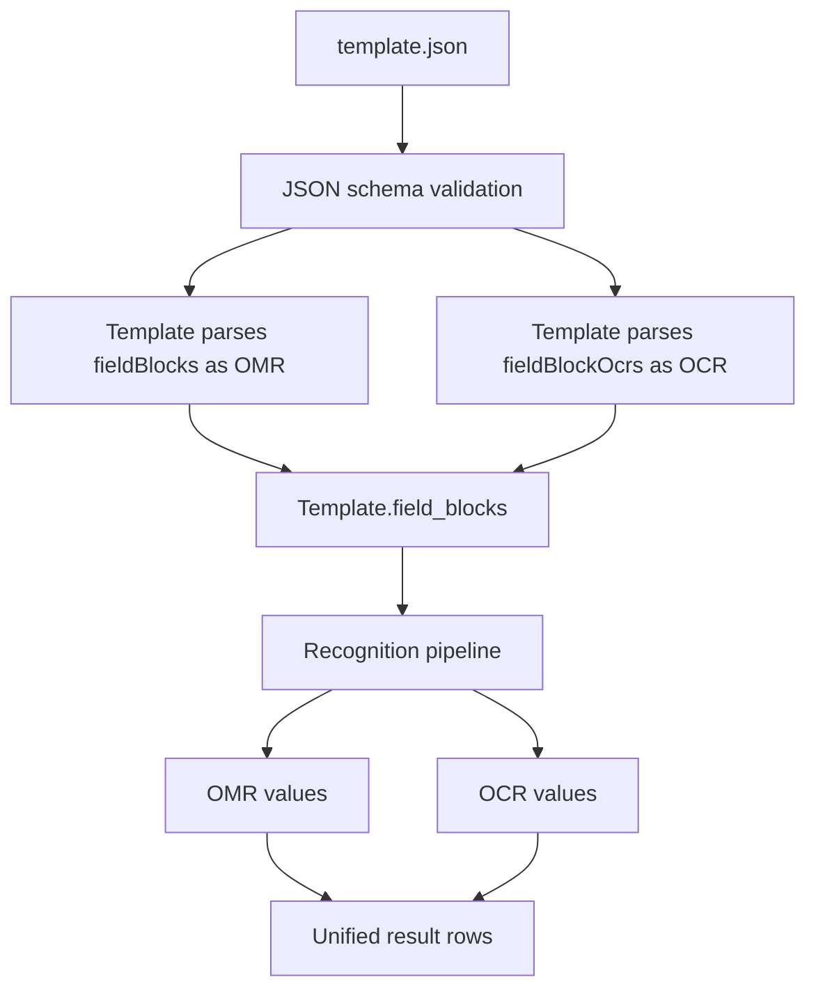

# fieldBlockOcrs OCR Template Configuration Design

## Context

The PaddleOCR integration originally extended `fieldBlocks` with an optional `engine` field. Existing OMR blocks default to `engine: "omr"`, while OCR blocks use `engine: "paddleocr"` and `dimensions`.

This works when clients send clean OCR blocks. It fails when the application serializer emits empty OMR default fields inside OCR blocks, such as empty `bubblesGap`, `labelsGap`, `fieldType`, or OMR-only values. JSON schema still validates present properties even when the OCR branch does not require them, so invalid empty OMR defaults can reject an otherwise valid OCR template.

## Decision

Add a separate top-level OCR template section named `fieldBlockOcrs`.

- `fieldBlocks` remains the OMR-only block collection and keeps its current validation rules.
- `fieldBlockOcrs` contains only OCR recognition regions and uses an OCR-specific schema.
- The runtime parser loads both collections and appends both block types to the same internal `Template.field_blocks` list.
- Output labels, custom labels, duplicate-label detection, and region boundary validation operate across both OMR and OCR blocks.

This isolates OCR configuration from application-side OMR defaults without weakening OMR validation.

## Template Shape

```json
{
  "fieldBlocks": {
    "q_block": {
      "fieldType": "QTYPE_MCQ4",
      "origin": [100, 300],
      "fieldLabels": ["q1..q10"],
      "bubblesGap": 40,
      "labelsGap": 30
    }
  },
  "fieldBlockOcrs": {
    "blank_score": {
      "fieldLabels": ["blankScore1"],
      "origin": [120, 80],
      "dimensions": [160, 60],
      "regionCode": "blankScore",
      "regionName": "填空题得分区域",
      "type": "BLANK_SCORE",
      "ocr": {
        "lang": "ch",
        "det": false,
        "rec": true,
        "cls": true,
        "returnConfidence": true,
        "archiveRegion": true
      }
    }
  }
}
```

## Schema Rules

### `fieldBlocks`

Keep OMR semantics strict:

- Required globally by the existing template schema.
- Continues to require `origin` and `fieldLabels`.
- Continues to require OMR-specific shape through `bubblesGap`, `labelsGap`, and either `fieldType` or custom `bubbleValues` plus `direction`.
- Existing OMR templates remain valid without migration.

### `fieldBlockOcrs`

Add as an optional top-level property:

- Type: object.
- Keys are block names, matching `fieldBlocks` style.
- Each block requires `origin`, `dimensions`, and `fieldLabels`.
- Each block allows optional `regionCode`, `regionName`, `type`, and `ocr`.
- `ocr` allows `lang`, `det`, `rec`, `cls`, `returnConfidence`, and `archiveRegion` only.
- OMR-only fields are not part of this schema. If the application sends empty OMR defaults, they should be sent under `fieldBlocks`, not `fieldBlockOcrs`.

## Runtime Parsing

`Template.__init__` should read both sections:

- `fieldBlocks` into `field_blocks_object`.
- `fieldBlockOcrs` into `field_block_ocrs_object`, defaulting to `{}` when omitted.

Parsing should be split by intent:

1. Parse each `fieldBlocks` item as OMR.
2. Parse each `fieldBlockOcrs` item as OCR.
3. For OCR blocks, inject or set `engine: "paddleocr"` before creating `FieldBlock`.
4. Add both block types to `self.field_blocks`.
5. Reuse `validate_parsed_labels()` for both block types so duplicate labels and out-of-page regions are caught consistently.

`FieldBlock.setup_ocr_field_block()` can remain the OCR-specific setup path. It should continue to require that `fieldLabels` resolves to exactly one field label for the first version.

## Data Flow



## Backward Compatibility

- Existing templates using only `fieldBlocks` continue to work unchanged.
- Existing OCR templates that used `fieldBlocks` with `engine: "paddleocr"` should be treated as transitional. The recommended API contract moves OCR blocks to `fieldBlockOcrs`.
- If compatibility with old OCR-in-`fieldBlocks` templates is required, the parser may still accept `engine: "paddleocr"` in `fieldBlocks`, but new clients should not rely on it.

## Error Handling

Validation failures should make the problematic section clear:

- OMR block errors should point to `fieldBlocks.<blockName>`.
- OCR block errors should point to `fieldBlockOcrs.<blockName>`.
- Duplicate labels across OMR and OCR should keep the current overlap error behavior.
- OCR blocks outside page boundaries should reuse the existing overflow error behavior.

## Test Plan

Add or update tests for these cases:

1. Existing OMR-only template validates and parses unchanged.
2. Template with `fieldBlocks` plus `fieldBlockOcrs` validates and parses.
3. OCR block with valid `origin`, `dimensions`, and one `fieldLabels` item creates a `FieldBlock` with `engine == "paddleocr"`.
4. OCR block missing `dimensions` fails schema validation.
5. Invalid OMR block still fails OMR validation.
6. Duplicate label between `fieldBlocks` and `fieldBlockOcrs` fails parsing.
7. OCR block outside `pageDimensions` fails parsing.
8. Application payload with OCR data in `fieldBlockOcrs` is unaffected by empty/default OMR fields elsewhere.

## Alternative Considered

The main alternative was to keep a unified `fieldBlocks` collection and add server-side cleanup that removes empty OMR-only properties from OCR blocks before validation. That preserves a single block list, but it weakens the validation boundary and makes the backend compensate for client serialization details. `fieldBlockOcrs` creates a clearer contract with lower risk to OMR behavior.
